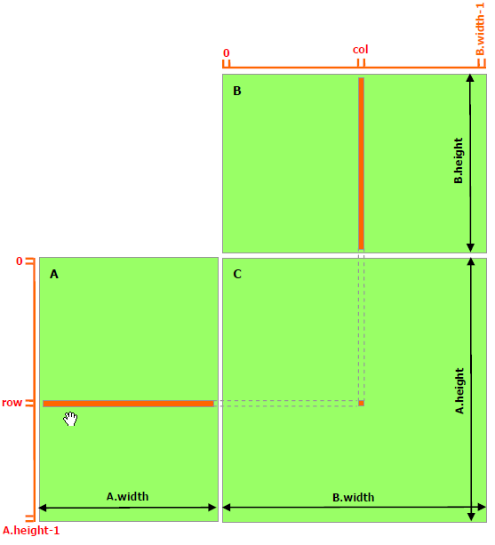
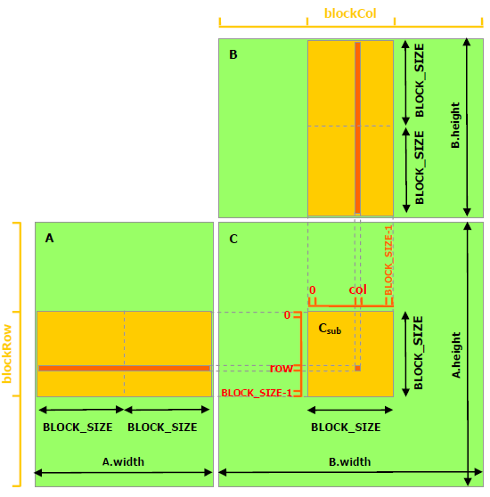
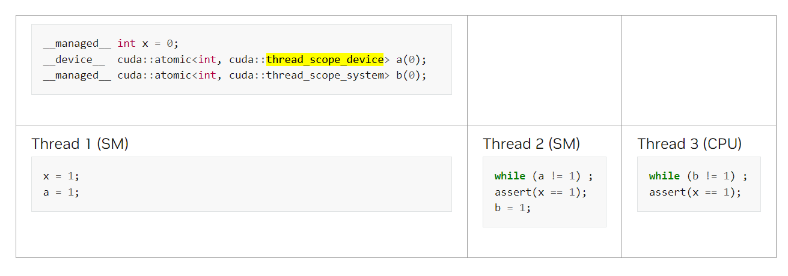

### 3.2.4. Shared Memory
> \_\_shared\_\_   
* 第一种

>  A is only read (B.width / block_size) times from global memory and B is read (A.height / block_size) times.

``` 
// Matrices are stored in row-major order:
// M(row, col) = *(M.elements + row * M.width + col)
typedef struct {
    int width;
    int height;
    float* elements;
} Matrix;

// Thread block size
#define BLOCK_SIZE 16

// Forward declaration of the matrix multiplication kernel
__global__ void MatMulKernel(const Matrix, const Matrix, Matrix);

// Matrix multiplication - Host code
// Matrix dimensions are assumed to be multiples of BLOCK_SIZE
void MatMul(const Matrix A, const Matrix B, Matrix C)
{
    // Load A and B to device memory
    Matrix d_A;
    d_A.width = A.width; d_A.height = A.height;
    size_t size = A.width * A.height * sizeof(float);
    cudaMalloc(&d_A.elements, size);
    cudaMemcpy(d_A.elements, A.elements, size,
               cudaMemcpyHostToDevice);
    Matrix d_B;
    d_B.width = B.width; d_B.height = B.height;
    size = B.width * B.height * sizeof(float);
    cudaMalloc(&d_B.elements, size);
    cudaMemcpy(d_B.elements, B.elements, size,
               cudaMemcpyHostToDevice);

    // Allocate C in device memory
    Matrix d_C;
    d_C.width = C.width; d_C.height = C.height;
    size = C.width * C.height * sizeof(float);
    cudaMalloc(&d_C.elements, size);

    // Invoke kernel
    dim3 dimBlock(BLOCK_SIZE, BLOCK_SIZE);
    dim3 dimGrid(B.width / dimBlock.x, A.height / dimBlock.y);
    MatMulKernel<<<dimGrid, dimBlock>>>(d_A, d_B, d_C);

    // Read C from device memory
    cudaMemcpy(C.elements, d_C.elements, size,
               cudaMemcpyDeviceToHost);

    // Free device memory
    cudaFree(d_A.elements);
    cudaFree(d_B.elements);
    cudaFree(d_C.elements);
}

// Matrix multiplication kernel called by MatMul()
__global__ void MatMulKernel(Matrix A, Matrix B, Matrix C)
{
    // Each thread computes one element of C
    // by accumulating results into Cvalue
    float Cvalue = 0;
    int row = blockIdx.y * blockDim.y + threadIdx.y;
    int col = blockIdx.x * blockDim.x + threadIdx.x;
    for (int e = 0; e < A.width; ++e)
        Cvalue += A.elements[row * A.width + e]
                * B.elements[e * B.width + col];
    C.elements[row * C.width + col] = Cvalue;
}
```

* 第二种

``` 
 // Matrices are stored in row-major order:
// M(row, col) = *(M.elements + row * M.stride + col)
typedef struct {
    int width;
    int height;
    int stride;
    float* elements;
} Matrix;
// Get a matrix element
__device__ float GetElement(const Matrix A, int row, int col)
{
    return A.elements[row * A.stride + col];
}
// Set a matrix element
__device__ void SetElement(Matrix A, int row, int col,
                           float value)
{
    A.elements[row * A.stride + col] = value;
}
// Get the BLOCK_SIZExBLOCK_SIZE sub-matrix Asub of A that is
// located col sub-matrices to the right and row sub-matrices down
// from the upper-left corner of A
 __device__ Matrix GetSubMatrix(Matrix A, int row, int col)
{
    Matrix Asub;
    Asub.width    = BLOCK_SIZE;
    Asub.height   = BLOCK_SIZE;
    Asub.stride   = A.stride;
    Asub.elements = &A.elements[A.stride * BLOCK_SIZE * row
                                         + BLOCK_SIZE * col];
    return Asub;
}
// Thread block size
#define BLOCK_SIZE 16
// Forward declaration of the matrix multiplication kernel
__global__ void MatMulKernel(const Matrix, const Matrix, Matrix);
// Matrix multiplication - Host code
// Matrix dimensions are assumed to be multiples of BLOCK_SIZE
void MatMul(const Matrix A, const Matrix B, Matrix C)
{
    // Load A and B to device memory
    Matrix d_A;
    d_A.width = d_A.stride = A.width; d_A.height = A.height;
    size_t size = A.width * A.height * sizeof(float);
    cudaMalloc(&d_A.elements, size);
    cudaMemcpy(d_A.elements, A.elements, size,
               cudaMemcpyHostToDevice);
    Matrix d_B;
    d_B.width = d_B.stride = B.width; d_B.height = B.height;
    size = B.width * B.height * sizeof(float);
    cudaMalloc(&d_B.elements, size);
    cudaMemcpy(d_B.elements, B.elements, size,
    cudaMemcpyHostToDevice);
    // Allocate C in device memory
    Matrix d_C;
    d_C.width = d_C.stride = C.width; d_C.height = C.height;
    size = C.width * C.height * sizeof(float);
    cudaMalloc(&d_C.elements, size);
    // Invoke kernel
    dim3 dimBlock(BLOCK_SIZE, BLOCK_SIZE);
    dim3 dimGrid(B.width / dimBlock.x, A.height / dimBlock.y);
    MatMulKernel<<<dimGrid, dimBlock>>>(d_A, d_B, d_C);
    // Read C from device memory
    cudaMemcpy(C.elements, d_C.elements, size,
               cudaMemcpyDeviceToHost);
    // Free device memory
    cudaFree(d_A.elements);
    cudaFree(d_B.elements);
    cudaFree(d_C.elements);
}
// Matrix multiplication kernel called by MatMul()
 __global__ void MatMulKernel(Matrix A, Matrix B, Matrix C)
{
    // Block row and column
    int blockRow = blockIdx.y;
    int blockCol = blockIdx.x;
    // Each thread block computes one sub-matrix Csub of C
    Matrix Csub = GetSubMatrix(C, blockRow, blockCol);
    // Each thread computes one element of Csub
    // by accumulating results into Cvalue
    float Cvalue = 0;
    // Thread row and column within Csub
    int row = threadIdx.y;
    int col = threadIdx.x;
    // Loop over all the sub-matrices of A and B that are
    // required to compute Csub
    // Multiply each pair of sub-matrices together
    // and accumulate the results
    for (int m = 0; m < (A.width / BLOCK_SIZE); ++m) {
        // Get sub-matrix Asub of A
        Matrix Asub = GetSubMatrix(A, blockRow, m);
        // Get sub-matrix Bsub of B
        Matrix Bsub = GetSubMatrix(B, m, blockCol);
        // Shared memory used to store Asub and Bsub respectively
        __shared__ float As[BLOCK_SIZE][BLOCK_SIZE];
        __shared__ float Bs[BLOCK_SIZE][BLOCK_SIZE];
        // Load Asub and Bsub from device memory to shared memory
        // Each thread loads one element of each sub-matrix
        As[row][col] = GetElement(Asub, row, col);
        Bs[row][col] = GetElement(Bsub, row, col);
        // Synchronize to make sure the sub-matrices are loaded
        // before starting the computation
        __syncthreads();
        // Multiply Asub and Bsub together
        for (int e = 0; e < BLOCK_SIZE; ++e)
            Cvalue += As[row][e] * Bs[e][col];
        // Synchronize to make sure that the preceding
        // computation is done before loading two new
        // sub-matrices of A and B in the next iteration
        __syncthreads();
    }
    // Write Csub to device memory
    // Each thread writes one element
    SetElement(Csub, row, col, Cvalue);
}
```


### 3.2.5. Distributed Shared Memory
> 线程块集群使线程块集群中的线程能够访问集群中所有参与线程块的共享内存。这种分区共享内存称为分布式共享内存，对应的地址空间称为分布式共享内存地址空间。   
> 分布式共享内存的大小就是每个集群的线程块数乘以每个线程块的共享内存大小。  
> cluster.sync()   
> 访问分布式共享内存中的数据需要所有线程块都存在。用户可以保证所有线程块都已使用 cluster.sync() 集群组 API 开始执行。用户还需要确保所有分布式共享内存操作都发生在线程块退出之前，例如，如果远程线程块试图读取给定线程块的共享内存，用户需要确保远程线程块读取的共享内存在退出之前完成。

``` 
#include <cooperative_groups.h>

// Distributed Shared memory histogram kernel
__global__ void clusterHist_kernel(int *bins, const int nbins, const int bins_per_block, const int *__restrict__ input,
                                   size_t array_size)
{
  extern __shared__ int smem[];
  namespace cg = cooperative_groups;
  int tid = cg::this_grid().thread_rank();

  // Cluster initialization, size and calculating local bin offsets.
  cg::cluster_group cluster = cg::this_cluster();
  unsigned int clusterBlockRank = cluster.block_rank();
  int cluster_size = cluster.dim_blocks().x;

  for (int i = threadIdx.x; i < bins_per_block; i += blockDim.x)
  {
    smem[i] = 0; //Initialize shared memory histogram to zeros
  }

  // cluster synchronization ensures that shared memory is initialized to zero in
  // all thread blocks in the cluster. It also ensures that all thread blocks
  // have started executing and they exist concurrently.
  cluster.sync();

  for (int i = tid; i < array_size; i += blockDim.x * gridDim.x)
  {
    int ldata = input[i];

    //Find the right histogram bin.
    int binid = ldata;
    if (ldata < 0)
      binid = 0;
    else if (ldata >= nbins)
      binid = nbins - 1;

    //Find destination block rank and offset for computing
    //distributed shared memory histogram
    int dst_block_rank = (int)(binid / bins_per_block);
    int dst_offset = binid % bins_per_block;

    //Pointer to target block shared memory
    int *dst_smem = cluster.map_shared_rank(smem, dst_block_rank);

    //Perform atomic update of the histogram bin
    atomicAdd(dst_smem + dst_offset, 1);
  }

  // cluster synchronization is required to ensure all distributed shared
  // memory operations are completed and no thread block exits while
  // other thread blocks are still accessing distributed shared memory
  cluster.sync();

  // Perform global memory histogram, using the local distributed memory histogram
  int *lbins = bins + cluster.block_rank() * bins_per_block;
  for (int i = threadIdx.x; i < bins_per_block; i += blockDim.x)
  {
    atomicAdd(&lbins[i], smem[i]);
  }
}
```
* main
``` 
// Launch via extensible launch
{
  cudaLaunchConfig_t config = {0};
  config.gridDim = array_size / threads_per_block;
  config.blockDim = threads_per_block;

  // cluster_size depends on the histogram size.
  // ( cluster_size == 1 ) implies no distributed shared memory, just thread block local shared memory
  int cluster_size = 2; // size 2 is an example here
  int nbins_per_block = nbins / cluster_size;

  //dynamic shared memory size is per block.
  //Distributed shared memory size =  cluster_size * nbins_per_block * sizeof(int)
  config.dynamicSmemBytes = nbins_per_block * sizeof(int);

  CUDA_CHECK(::cudaFuncSetAttribute((void *)clusterHist_kernel, cudaFuncAttributeMaxDynamicSharedMemorySize, config.dynamicSmemBytes));

  cudaLaunchAttribute attribute[1];
  attribute[0].id = cudaLaunchAttributeClusterDimension;
  attribute[0].val.clusterDim.x = cluster_size;
  attribute[0].val.clusterDim.y = 1;
  attribute[0].val.clusterDim.z = 1;

  config.numAttrs = 1;
  config.attrs = attribute;

  cudaLaunchKernelEx(&config, clusterHist_kernel, bins, nbins, nbins_per_block, input, array_size);
}
```

### 3.2.6. Page-Locked Host Memory
> 运行时提供函数以允许使用页面锁定（也称为固定）主机内存（而不是由以下机构分配的 malloc() 常规可分页主机内存）： 
> 1. cudaHostAlloc() 分配 cudaFreeHost() 和释放页面锁定的主机内存; 
> 2. cudaHostRegister() page-lock 分配的内存范围 malloc() （有关限制，请参阅参考手册）。

* 好处
1. 对于某些设备，页面锁定主机内存和设备内存之间的复制可以与内核执行同时执行，如异步并发执行中所述。
2. 在某些设备上，页面锁定的主机内存可以映射到设备的地址空间，无需将其复制到设备内存或从设备内存复制，如映射内存中所述。
3. 在具有前端总线的系统上，如果主机内存被分配为页面锁定，则主机内存和设备内存之间的带宽会更高，如果另外它被分配为写组合，则更高，如写组合内存中所述。


#### 3.2.6.1. Portable Memory
> 默认情况下，使用上述页面锁定内存的好处仅适用于分配块时处于当前状态的设备  
> 要使这些优势适用于所有设备，需要通过将标志传递给 来分配块， cudaHostAlloc() 或者通过将标志 cudaHostAllocPortable cudaHostRegisterPortable 传递给 cudaHostRegister() 来锁定页面。


#### 3.2.6.2. Write-Combining Memory
> cudaHostAllocWriteCombined 代替 cudaHostAlloc()

* 优势
  * 写入组合内存释放了主机的 L1 和 L2 缓存资源，使更多缓存可供应用程序的其余部分使用。
  * 在通过 PCI Express 总线传输期间，写入组合内存不会被窥探，这可以将传输性能提高多达 40%。

* 缺点
  * 从主机的写入组合内存中读取速度非常慢，因此写入组合内存通常应用于主机仅写入的内存。


#### 3.2.6.3. Mapped Memory
> cudaHostAllocMapped to cudaHostAlloc() or by passing flag cudaHostRegisterMapped to cudaHostRegister()   
> 因此，这样的块通常有两个地址：一个在主机内存中，由 cudaHostAlloc() 或 malloc() 返回，另一个在设备内存中，可以使用该地址进行检索 cudaHostGetDevicePointer() ，然后用于从内核中访问该块  
> 唯一的例外是， cudaHostAlloc() 当主机和设备使用统一地址空间时，分配了指针，如统一虚拟地址空间中所述。

* advantages
    * 无需在设备内存中分配一个块，也无需在该块和主机内存中的块之间复制数据;数据传输由内核根据需要隐式执行;
    * 无需使用流（请参阅并发数据传输）来将数据传输与内核执行重叠;源自内核的数据传输自动与内核执行重叠。
> 但是，由于映射的页面锁定内存在主机和设备之间共享，因此应用程序必须使用流或事件同步内存访问（请参阅异步并发执行），以避免任何潜在的先写后写、后写或后写危险。  
> 为了能够检索指向任何映射的页面锁定内存的设备指针，必须在执行任何其他 CUDA 调用之前，通过使用该 cudaDeviceMapHost 标志进行调用 cudaSetDeviceFlags() 来启用页面锁定内存映射。否则， cudaHostGetDevicePointer() 将返回错误。

---
### 3.2.7. Memory Synchronization Domains

#### 3.2.7.1. Memory Fence Interference
> 某些 CUDA 应用程序可能会看到性能下降，因为内存fence/flush operations 等待的事务数量超过了 CUDA 内存一致性模型所需的事务。


> 上例中，为了保证断言为true，线程一必须在线程3之前运行， 最后执行线程2   
> 释放和获取提供的 a 内存排序仅足以使 x 线程 2 可见，而不是线程 3，因为它是设备范围操作。因此 b ，release 和 acquire 提供的系统范围排序需要确保不仅从线程 2 本身发出的写入对线程 3 可见，而且从其他线程发出的对线程 2 可见的写入。这被称为累积性。    
> 这有时会导致干扰：由于 GPU 正在等待内存操作，因此在源级别不需要它，因此隔离/刷新可能需要比必要时间更长的时间
  

#### 3.2.7.2. Isolating Traffic with Domains
> 从 Hopper 架构 GPU 和 CUDA 12.0 开始，内存同步域功能提供了一种减轻此类干扰的方法。作为代码的显式帮助的交换，GPU 可以减少围栏操作的网络投射。每次内核启动都会被赋予一个域 ID。写入和围栏都用该 ID 标记，并且围栏只会对与围栏的域匹配的写入进行排序。在并发计算与通信示例中，通信内核可以放置在不同的域中。  
> 使用域时，代码必须遵守以下规则，即在同一 GPU 上的不同域之间排序或同步需要系统范围的隔离。在域中，设备范围的隔离仍然足够。这对于累积性是必要的，因为一个内核的写入不会被另一个域中的内核发出的围栏所包含。从本质上讲，通过确保提前将跨域流量刷新到系统范围来满足累积性。  
> 请注意，这将修改 thread_scope_device 的定义。但是，由于内核将默认为域 0（如下所述），因此将保持向后兼容性

#### 3.2.7.3. Using Domains in CUDA
> cudaLaunchAttributeMemSyncDomain and cudaLaunchAttributeMemSyncDomainMap    
> 前者在逻辑域 cudaLaunchMemSyncDomainDefault 和 cudaLaunchMemSyncDomainRemote 之间进行选择，后者提供从逻辑域到物理域的映射。  
> 可以通过 device 属性 cudaDevAttrMemSyncDomainCount 查询域计数。Hopper 有 4 个域。为了便于移植代码，域功能可以在所有设备上使用，CUDA 将在 Hopper 之前报告计数 1。   

> 拥有逻辑域可简化应用程序组合。在堆栈的低级别启动单个内核（例如从 NCCL）可以选择语义逻辑域，而无需考虑周围的应用程序体系结构。更高级别可以使用映射来引导逻辑域。如果未设置逻辑域，则逻辑域的缺省值为缺省域，缺省映射是将缺省域映射到 0，将远程域映射到 1（在具有 1 个以上域的 GPU 上）。特定库可以在 CUDA 12.0 及更高版本中使用远程域标记启动;例如，NCCL 2.16 将这样做。总之，这为开箱即用的常见应用程序提供了一种有益的使用模式，无需在其他组件、框架或应用程序级别进行代码更改。另一种使用模式，例如在使用 nvshmem 或没有明确分离内核类型的应用程序中，可能是对并行流进行分区。流 A 可以将两个逻辑域映射到物理域 0，将流 B 映射到 1，依此类推。
``` 
// Example of launching a kernel with the remote logical domain
cudaLaunchAttribute domainAttr;
domainAttr.id = cudaLaunchAttrMemSyncDomain;
domainAttr.val = cudaLaunchMemSyncDomainRemote;
cudaLaunchConfig_t config;
// Fill out other config fields
config.attrs = &domainAttr;
config.numAttrs = 1;
cudaLaunchKernelEx(&config, myKernel, kernelArg1, kernelArg2...);
```

``` 
// Example of setting a mapping for a stream
// (This mapping is the default for streams starting on Hopper if not
// explicitly set, and provided for illustration)
cudaLaunchAttributeValue mapAttr;
mapAttr.memSyncDomainMap.default_ = 0;
mapAttr.memSyncDomainMap.remote = 1;
cudaStreamSetAttribute(stream, cudaLaunchAttrMemSyncDomainMap, &mapAttr);
```

``` 
// Example of mapping different streams to different physical domains, ignoring
// logical domain settings
cudaLaunchAttributeValue mapAttr;
mapAttr.memSyncDomainMap.default_ = 0;
mapAttr.memSyncDomainMap.remote = 0;
cudaStreamSetAttribute(streamA, cudaLaunchAttrMemSyncDomainMap, &mapAttr);
mapAttr.memSyncDomainMap.default_ = 1;
mapAttr.memSyncDomainMap.remote = 1;
cudaStreamSetAttribute(streamB, cudaLaunchAttrMemSyncDomainMap, &mapAttr);
```

