#### 3.2.8.7.4. CUDA User Objects
> CUDA 用户对象可用于帮助管理 CUDA 中异步工作使用的资源的生命周期，此功能对于 CUDA 图形和流捕获非常有用。  
> 各种资源管理方案与 CUDA graph 不兼容。例如，考虑基于事件的池或同步创建、异步销毁方案。

> 当引用关联到 CUDA 图时，CUDA 将自动管理图操作。克隆保留 cudaGraph_t 源 cudaGraph_t 所拥有的每个引用的副本，具有相同的多重性。实例化 cudaGraphExec_t 保留源 cudaGraph_t 中每个引用的副本。当 a cudaGraphExec_t 在未同步的情况下被销毁时，引用将保留，直到执行完成。

``` 
cudaGraph_t graph;  // Preexisting graph

Object *object = new Object;  // C++ object with possibly nontrivial destructor
cudaUserObject_t cuObject;
cudaUserObjectCreate(
    &cuObject,
    object,  // Here we use a CUDA-provided template wrapper for this API,
             // which supplies a callback to delete the C++ object pointer
    1,  // Initial refcount
    cudaUserObjectNoDestructorSync  // Acknowledge that the callback cannot be
                                    // waited on via CUDA
);
cudaGraphRetainUserObject(
    graph,
    cuObject,
    1,  // Number of references
    cudaGraphUserObjectMove  // Transfer a reference owned by the caller (do
                             // not modify the total reference count)
);
// No more references owned by this thread; no need to call release API
cudaGraphExec_t graphExec;
cudaGraphInstantiate(&graphExec, graph, nullptr, nullptr, 0);  // Will retain a
                                                               // new reference
cudaGraphDestroy(graph);  // graphExec still owns a reference
cudaGraphLaunch(graphExec, 0);  // Async launch has access to the user objects
cudaGraphExecDestroy(graphExec);  // Launch is not synchronized; the release
                                  // will be deferred if needed
cudaStreamSynchronize(0);  // After the launch is synchronized, the remaining
                           // reference is released and the destructor will
                           // execute. Note this happens asynchronously.
// If the destructor callback had signaled a synchronization object, it would
// be safe to wait on it at this point.
```
> 子图节点中的图所拥有的引用与子图相关联，而不是与父图相关联。如果更新或删除子图，则引用会相应更改。如果使用 cudaGraphExecUpdate 或 更新可执行图或 cudaGraphExecChildGraphNodeSetParams 子图，则会克隆新源图中的引用，并替换目标图中的引用。无论哪种情况，如果以前的启动未同步，则将保留将释放的任何引用，直到启动完成执行。  
> 目前没有通过 CUDA API 等待用户对象析构函数的机制。用户可以从析构函数代码手动向同步对象发出信号。此外，从析构函数调用 CUDA API 是不合法的，类似于对 cudaLaunchHostFunc 的限制。这是为了避免阻塞 CUDA 内部共享线程并阻止前进。如果依赖项是单向的，并且执行调用的线程无法阻止 CUDA 工作的向前进度，则向另一个线程发出信号以执行 API 调用是合法的。  


##### 3.2.8.7.5. Updating Instantiated Graphs
> 使用图形提交工作分为三个不同的阶段： definition, instantiation, and execution。在工作流没有变化的情况下，定义和实例化的开销可以在多次执行中分摊，并且图形比流具有明显的优势。  
> 图形是工作流的快照，包括内核、参数和依赖项，以便尽可能快速有效地重放它。在工作流更改的情况下，图形将过期，必须进行修改。对图形结构（如拓扑或节点类型）的重大更改将需要重新实例化源图形，因为必须重新应用各种与拓扑相关的优化技术。  
> 重复实例化的成本会降低图形执行的整体性能优势，但只有节点参数（如内核参数和 cudaMemcpy 地址）会发生变化，而图形拓扑保持不变，这是很常见的。对于这种情况，CUDA 提供了一种称为“图形更新”的轻量级机制，它允许就地修改某些节点参数，而无需重新构建整个图形。这比重新实例化要高效得多。  
> 更新将在下次启动图形时生效，因此它们不会影响以前的图形启动，即使它们在更新时正在运行。图形可以重复更新和重新启动，因此可以在流上排队进行多个更新/启动。    
> CUDA 提供了两种更新实例化图参数的机制，全图更新和单节点更新。整个图形更新允许用户提供拓扑上相同的 cudaGraph_t 对象，其节点包含更新的参数。单个节点更新允许用户显式更新单个节点的参数。当正在更新大量节点时，或者当调用方不知道图形拓扑时（即，由库调用的流捕获生成的图形），使用更新 cudaGraph_t 更方便。当更改数量较少且用户具有需要更新的节点的句柄时，首选使用单个节点更新。单个节点更新跳过了对未更改节点的拓扑检查和比较，因此在许多情况下可以更有效。


###### 3.2.8.7.5.1. Graph Update Limitations
* Kernel nodes
  * 函数的所属上下文无法更改。
  * 函数原本不使用 CUDA 动态并行的节点无法更新为使用 CUDA 动态并行的函数。

* cudaMemset and cudaMemcpy nodes
  * operand(s) 分配/映射到的 CUDA devices 无法更改。
  * 源/目标内存必须从与原始源/目标内存相同的上下文中分配。
  * 只能更改 1D cudaMemset / cudaMemcpy 节点。

* 其他 memcpy 节点限制
  * 不支持更改源或目标内存类型（即 cudaPitchedPtr 、 cudaArray_t 等）或传输类型（即 cudaMemcpyKind ）。

* 外部信号量等待节点和记录节点
  * 不支持更改信号量的数量
  
* 条件节点
  * 图形之间的句柄创建和分配顺序必须匹配
  * 不支持更改节点参数（即条件、节点上下文中的图形数量等）
  * 更改条件主体图中节点的参数受上述规则的约束

* 对主机节点、事件记录节点或事件等待节点的更新没有限制。

###### 3.2.8.7.5.2. Whole Graph Update
> cudaGraphExecUpdate() 允许使用拓扑相同图（“更新”图）中的参数更新实例化图（“原始图”）。更新图的拓扑结构必须与用于实例化 cudaGraphExec_t .此外，指定依赖项的顺序必须匹配。最后，CUDA 需要一致地对接收器节点（没有依赖关系的节点）进行排序。CUDA 依靠特定 API 调用的顺序来实现一致的 sink 节点排序。  
> 更明确地说，遵循以下规则将导致 cudaGraphExecUpdate() 确定性地将原始图和更新图中的节点配对
> 1. 对于任何捕获流，对该流执行操作的 API 调用必须按相同的顺序进行，包括事件等待和其他与节点创建不直接对应的 API 调用。
> 2. 直接操作给定图节点的传入边缘（包括捕获的流 API、节点添加 API 和边缘添加/删除 API）的 API 调用必须按相同的顺序进行。此外，当在数组中指定这些 API 的依赖项时，在这些数组中指定依赖项的顺序必须匹配。
> 3. 接收器节点的顺序必须一致。接收器节点是调用时 cudaGraphExecUpdate() 最终图形中没有依赖节点/传出边缘的节点。以下操作会影响接收器节点排序（如果存在），并且必须（作为组合集）以相同的顺序进行
>    1. Node add APIs resulting in a sink node. 
>    2. Edge removal resulting in a node becoming a sink node. 
>    3. cudaStreamUpdateCaptureDependencies(), if it removes a sink node from a capturing stream’s dependency set. 
>    4. cudaStreamEndCapture()

``` 
cudaGraphExec_t graphExec = NULL;

for (int i = 0; i < 10; i++) {
    cudaGraph_t graph;
    cudaGraphExecUpdateResult updateResult;
    cudaGraphNode_t errorNode;

    // In this example we use stream capture to create the graph.
    // You can also use the Graph API to produce a graph.
    cudaStreamBeginCapture(stream, cudaStreamCaptureModeGlobal);

    // Call a user-defined, stream based workload, for example
    do_cuda_work(stream);

    cudaStreamEndCapture(stream, &graph);

    // If we've already instantiated the graph, try to update it directly
    // and avoid the instantiation overhead
    if (graphExec != NULL) {
        // If the graph fails to update, errorNode will be set to the
        // node causing the failure and updateResult will be set to a
        // reason code.
        cudaGraphExecUpdate(graphExec, graph, &errorNode, &updateResult);
    }

    // Instantiate during the first iteration or whenever the update
    // fails for any reason
    if (graphExec == NULL || updateResult != cudaGraphExecUpdateSuccess) {

        // If a previous update failed, destroy the cudaGraphExec_t
        // before re-instantiating it
        if (graphExec != NULL) {
            cudaGraphExecDestroy(graphExec);
        }
        // Instantiate graphExec from graph. The error node and
        // error message parameters are unused here.
        cudaGraphInstantiate(&graphExec, graph, NULL, NULL, 0);
    }

    cudaGraphDestroy(graph);
    cudaGraphLaunch(graphExec, stream);
    cudaStreamSynchronize(stream);
}
```
> 典型的工作流是使用流捕获或图形 API 创建初始 cudaGraph_t 。然后实例 cudaGraph_t 化并正常启动。初始启动后，将使用与初始图形相同的方法创建一个新 cudaGraph_t 图形，并 cudaGraphExecUpdate() 调用该图形。如果图形更新成功（由上述示例中的 updateResult 参数指示），则启动更新 cudaGraphExec_t 。如果更新因任何原因失败，则调用 cudaGraphExecDestroy() and cudaGraphInstantiate() 以销毁原始 cudaGraphExec_t 更新并实例化新更新。  
> 也可以直接更新 cudaGraph_t 节点（即 Using cudaGraphKernelNodeSetParams() ），然后更新 cudaGraphExec_t ，但是使用下一节中介绍的显式节点更新 API 会更有效。

###### 3.2.8.7.5.3. Individual node update
> 实例化的图节点参数可以直接更新。这消除了实例化的开销以及创建新的 cudaGraph_t .如果需要更新的节点数相对于图中的节点总数较小，则最好单独更新节点。以下方法可用于更新 cudaGraphExec_t 节点：
> 1. cudaGraphExecKernelNodeSetParams()
> 2. cudaGraphExecMemcpyNodeSetParams()
> 3. cudaGraphExecMemsetNodeSetParams()
> 4. cudaGraphExecHostNodeSetParams()
> 5. cudaGraphExecChildGraphNodeSetParams()
> 6. cudaGraphExecEventRecordNodeSetEvent()
> 7. cudaGraphExecEventWaitNodeSetEvent()
> 8. cudaGraphExecExternalSemaphoresSignalNodeSetParams()
> 9. cudaGraphExecExternalSemaphoresWaitNodeSetParams()


###### 3.2.8.7.5.4. Individual node enable
> 实例化图中的内核、memset 和 memcpy 节点可以使用 cudaGraphNodeSetEnabled（） API 启用或禁用。这允许创建一个图表，其中包含所需功能的超集，可以针对每次启动进行自定义。可以使用 cudaGraphNodeGetEnabled（） API 查询节点的启用状态。  
> 禁用的节点在功能上等同于空节点，直到它被重新启用。节点参数不受启用/禁用节点的影响。启用状态不受单个节点更新或使用 cudaGraphExecUpdate（） 进行整个图形更新的影响。节点被禁用时的参数更新将在节点重新启用时生效。  
> 以下方法可用于启用/禁用 cudaGraphExec_t 节点，以及查询其状态：
> 1. cudaGraphNodeSetEnabled()
> 2. cudaGraphNodeGetEnabled()

---
##### 3.2.8.7.6. Using Graph APIs
> cudaGraph_t 对象不是线程安全的。用户有责任确保多个线程不会同时访问同一个 cudaGraph_t 线程  
> A cudaGraphExec_t 不能与自身同时运行。在之前启动同一可执行图之后，将有序启动。 cudaGraphExec_t  
> 图形执行在流中完成，以便与其他异步工作一起排序。但是，该流仅用于排序;它不会约束图的内部并行度，也不会影响图节点的执行位置。

---
##### 3.2.8.7.7. Device Graph Launch
> 有许多工作流需要在运行时做出与数据相关的决策，并根据这些决策执行不同的操作。用户可能更愿意在设备上执行此决策过程，而不是将此决策过程卸载到主机，这可能需要从设备往返。为此，CUDA 提供了一种从设备启动图形的机制  
> 可以从设备启动的图形将称为device graphs（设备图形），而无法从设备启动的图形将称为host graphs（主机图形）。  
> 设备图可以从主机和设备启动，而主机图只能从主机启动。与主机启动不同，在运行上一次启动设备图时从设备启动设备图将导致错误，返回 cudaErrorInvalidValue ;因此，不能同时从设备启动两次设备图。同时从主机和设备启动设备图将导致未定义的行为。

###### 3.2.8.7.7.1. Device Graph Creation
>  为了从设备启动图形，必须显式实例化该图形以启动设备。这是通过将 cudaGraphInstantiateFlagDeviceLaunch 标志传递给呼叫来实现 cudaGraphInstantiate() 的。与主机图一样，设备图结构在实例化时是固定的，如果不重新实例化就无法更新，并且实例化只能在主机上执行。为了使图形能够实例化以进行设备启动，它必须符合各种要求。

* 3.2.8.7.7.1.1. Device Graph Requirements
> General requirements
> 1. The graph’s nodes must all reside on a single device
> 2. The graph can only contain kernel nodes, memcpy nodes, memset nodes, and child graph nodes

> Kernel nodes
> 1. Use of CUDA Dynamic Parallelism by kernels in the graph is not permitted
> 2. Cooperative launches are permitted so long as MPS is not in use.

> Memcpy nodes
> 1. 仅允许涉及设备内存和/或固定设备映射主机内存的副本
> 2. 不允许涉及 CUDA 数组的副本。
> 3. 在实例化时，这两个操作数都必须可从当前设备访问。请注意，复制操作将从图形所在的设备执行，即使它以另一台设备上的内存为目标也是如此。


* 3.2.8.7.7.1.2. Device Graph Upload
> 为了在设备上启动图形，必须首先将其上传到设备以填充必要的设备资源。这可以通过以下两种方式之一实现。 
> 1. 首先，可以通过 显式上传图形， cudaGraphUpload() 也可以通过 请求上传作为实例化的一部分 cudaGraphInstantiateWithParams() 。
> 2. 或者，可以首先从主机启动图形，主机将在启动过程中隐式执行此上传步骤。

``` 
// Explicit upload after instantiation
cudaGraphInstantiate(&deviceGraphExec1, deviceGraph1, cudaGraphInstantiateFlagDeviceLaunch);
cudaGraphUpload(deviceGraphExec1, stream);

// Explicit upload as part of instantiation
cudaGraphInstantiateParams instantiateParams = {0};
instantiateParams.flags = cudaGraphInstantiateFlagDeviceLaunch | cudaGraphInstantiateFlagUpload;
instantiateParams.uploadStream = stream;
cudaGraphInstantiateWithParams(&deviceGraphExec2, deviceGraph2, &instantiateParams);

// Implicit upload via host launch
cudaGraphInstantiate(&deviceGraphExec3, deviceGraph3, cudaGraphInstantiateFlagDeviceLaunch);
cudaGraphLaunch(deviceGraphExec3, stream);
```
* 3.2.8.7.7.1.3. Device Graph Update
> 设备图只能从主机更新，并且必须在可执行图更新时重新上传到设备，才能使更改生效。这可以使用上一节中概述的相同方法实现。与主机图不同，在应用更新时从设备启动设备图将导致未定义的行为。

###### 3.2.8.7.7.2. Device Launch
> 设备图可以通过 从主机和设备启动 cudaGraphLaunch() ，这在设备上具有与主机上相同的签名。设备图通过主机和设备上的同一句柄启动。从设备启动时，必须从另一个图形启动设备图。

* 3.2.8.7.7.2.1. Device Launch Modes
> 与主机启动不同，设备图不能在常规 CUDA 流中启动，只能在不同的命名流中启动，每个命名流表示特定的启动模式

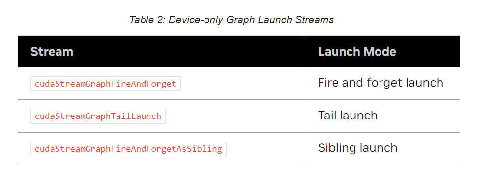

* 3.2.8.7.7.2.1.1. Fire and Forget Launch
> 顾名思义，即发即弃启动会立即提交给 GPU，并且它独立于启动图运行。在即发即弃方案中，启动图是父项，启动图是子项。

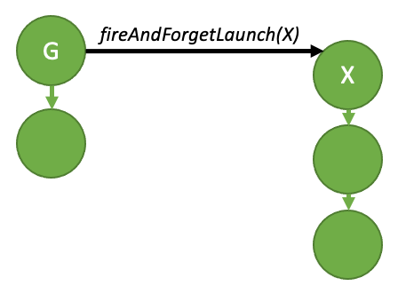
``` 
__global__ void launchFireAndForgetGraph(cudaGraphExec_t graph) {
    cudaGraphLaunch(graph, cudaStreamGraphFireAndForget);
}

void graphSetup() {
    cudaGraphExec_t gExec1, gExec2;
    cudaGraph_t g1, g2;

    // Create, instantiate, and upload the device graph.
    create_graph(&g2);
    cudaGraphInstantiate(&gExec2, g2, cudaGraphInstantiateFlagDeviceLaunch);
    cudaGraphUpload(gExec2, stream);

    // Create and instantiate the launching graph.
    cudaStreamBeginCapture(stream, cudaStreamCaptureModeGlobal);
    launchFireAndForgetGraph<<<1, 1, 0, stream>>>(gExec2);
    cudaStreamEndCapture(stream, &g1);
    cudaGraphInstantiate(&gExec1, g1);

    // Launch the host graph, which will in turn launch the device graph.
    cudaGraphLaunch(gExec1, stream);
}
```

* 3.2.8.7.7.2.1.2. Graph Execution Environments
> 为了充分理解设备端同步模型，首先需要了解执行环境的概念。  
> 当从设备启动图形时，它将启动到自己的执行环境中。给定图的执行环境将图中的所有工作以及所有生成的即发即弃工作封装在图中。当图形完成执行并且所有生成的子工作都已完成时，可以认为该图形已完成。  

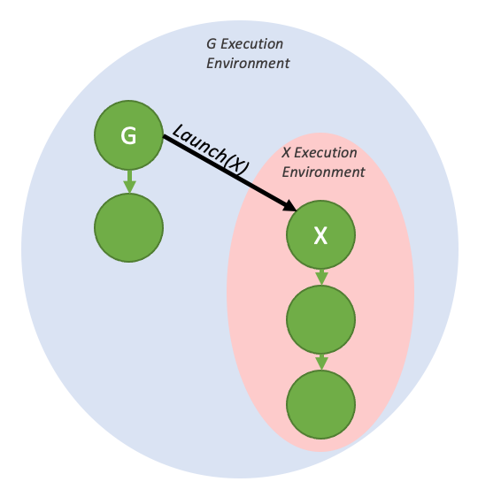
> 这些环境也是分层的，因此图形环境可以包含多个级别的子环境，这些子环境来自即发即弃启动。

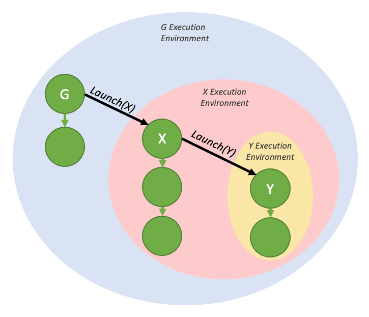

> 当从主机启动图形时，存在一个流环境，该环境是启动的图形的执行环境的父级。流环境封装了作为整个启动的一部分生成的所有工作。当整个流环境标记为完成时，流启动即完成（即，依赖于下游的工作现在可以运行）。

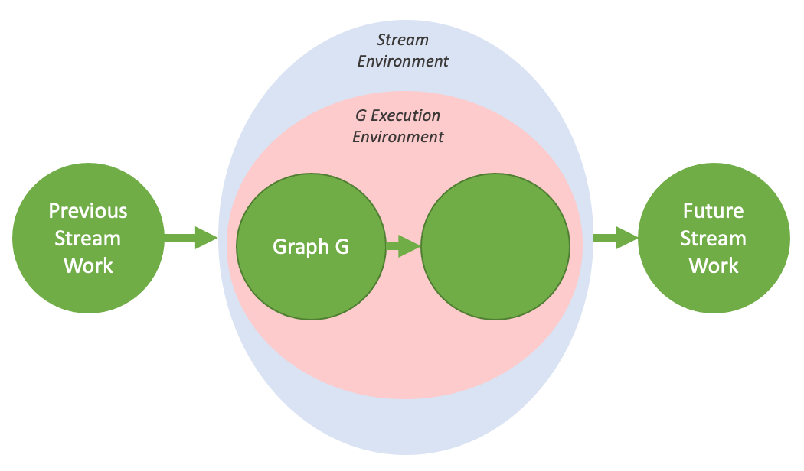

* 3.2.8.7.7.2.1.3. Tail Launch
> 与主机上不同，无法通过传统方法（如 cudaDeviceSynchronize() 或 cudaStreamSynchronize() ）与 GPU 中的设备图同步。相反，为了启用串行工作依赖关系，提供了不同的启动模式 - 尾部启动 - 以提供类似的功能。   
> 当图的环境被认为是完整的时，即当图及其所有子项都完成时，就会执行尾部启动。当图形完成时，尾部启动列表中下一个图形的环境将替换已完成的环境作为父环境的子环境。与即发即弃的启动一样，一个图形可以有多个图形排队等待尾部启动。  

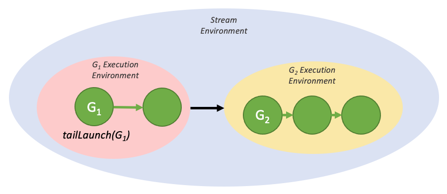

``` 
__global__ void launchTailGraph(cudaGraphExec_t graph) {
    cudaGraphLaunch(graph, cudaStreamGraphTailLaunch);
}

void graphSetup() {
    cudaGraphExec_t gExec1, gExec2;
    cudaGraph_t g1, g2;

    // Create, instantiate, and upload the device graph.
    create_graph(&g2);
    cudaGraphInstantiate(&gExec2, g2, cudaGraphInstantiateFlagDeviceLaunch);
    cudaGraphUpload(gExec2, stream);

    // Create and instantiate the launching graph.
    cudaStreamBeginCapture(stream, cudaStreamCaptureModeGlobal);
    launchTailGraph<<<1, 1, 0, stream>>>(gExec2);
    cudaStreamEndCapture(stream, &g1);
    cudaGraphInstantiate(&gExec1, g1);

    // Launch the host graph, which will in turn launch the device graph.
    cudaGraphLaunch(gExec1, stream);
}
```
> 由给定图形排队的尾部启动将按照排队时间的顺序一次执行一次。因此，第一个排队的图形将首先运行，然后是第二个，依此类推。

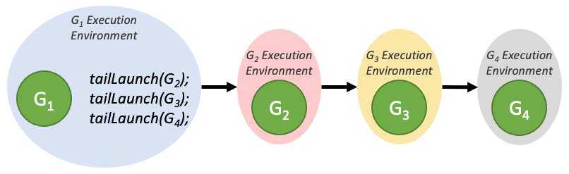

> 由尾部图排队的尾部启动将在尾部启动列表中先前的图排队的尾部启动之前执行。这些新的尾部启动将按照其排队顺序执行。

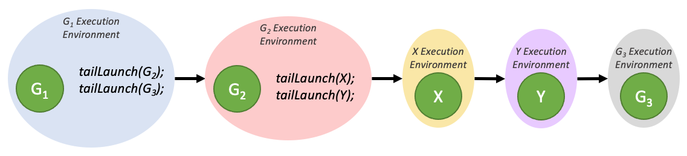

> 一个图形最多可以有 255 个待处理的尾部启动。


* 3.2.8.7.7.2.1.3.1. Tail Self-launch

> 设备图可以自行排队进行尾部启动，尽管给定图一次只能有一个自启动排队。为了查询当前正在运行的设备图以便重新启动它，添加了一个新的设备端函数：

``` 
cudaGraphExec_t cudaGetCurrentGraphExec();
```
> 如果当前正在运行的图形是设备图形，则此函数返回该图形的句柄。如果当前正在执行的内核不是设备图中的节点，则此函数将返回 NULL。

``` 
__device__ int relaunchCount = 0;

__global__ void relaunchSelf() {
    int relaunchMax = 100;

    if (threadIdx.x == 0) {
        if (relaunchCount < relaunchMax) {
            cudaGraphLaunch(cudaGetCurrentGraphExec(), cudaStreamGraphTailLaunch);
        }

        relaunchCount++;
    }
}
```


* 3.2.8.7.7.2.1.4. Sibling Launch
> Sibling Launch（同级启动）是即发即弃启动的一种变体，其中图形不是作为启动图的执行环境的子项启动，而是作为启动图父环境的子项启动。同级启动等同于从启动图的父环境进行即发即弃启动。

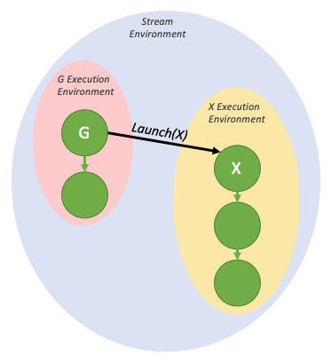
``` 
__global__ void launchSiblingGraph(cudaGraphExec_t graph) {
    cudaGraphLaunch(graph, cudaStreamGraphFireAndForgetAsSibling);
}

void graphSetup() {
    cudaGraphExec_t gExec1, gExec2;
    cudaGraph_t g1, g2;

    // Create, instantiate, and upload the device graph.
    create_graph(&g2);
    cudaGraphInstantiate(&gExec2, g2, cudaGraphInstantiateFlagDeviceLaunch);
    cudaGraphUpload(gExec2, stream);

    // Create and instantiate the launching graph.
    cudaStreamBeginCapture(stream, cudaStreamCaptureModeGlobal);
    launchSiblingGraph<<<1, 1, 0, stream>>>(gExec2);
    cudaStreamEndCapture(stream, &g1);
    cudaGraphInstantiate(&gExec1, g1);

    // Launch the host graph, which will in turn launch the device graph.
    cudaGraphLaunch(gExec1, stream);
}
```

--- 
##### 3.2.8.7.8. Conditional Graph Nodes
> Conditional nodes（条件节点）允许有条件地执行和循环条件节点中包含的图形。这允许动态和迭代工作流完全在图形中表示，并释放主机 CPU 以并行执行其他工作。  
> 当满足条件节点的依赖关系时，将在设备上执行条件值的评估。条件节点可以是以下类型之一
> 1. 如果条件 IF nodes （ IF 节点）在执行时条件值不为零，则执行一次其主体图。
> 2. 如果条件 WHILE nodes （WHILE 节点）在执行时条件值不为零，则该节点将执行其主体图，并将继续执行其主体图，直到条件值为零。

> 条件值由条件句柄访问，该句柄必须在节点之前创建。条件值可以通过设备代码使用 来 cudaGraphSetConditional() 设置。在创建句柄时，还可以指定在每次图形启动时应用的默认值。   
> 创建条件节点时，将创建一个空图形，并将句柄返回给用户，以便可以填充该图形。可以使用图形 API 或 cudaStreamBeginCaptureToGraph（） 填充此条件正文图。   
> 条件节点可以嵌套。


###### 3.2.8.7.8.1. Conditional Handles
> A condition value is represented by cudaGraphConditionalHandle and is created by cudaGraphConditionalHandleCreate().   
> The handle must be associated with a single conditional node. Handles cannot be destroyed.  
> 如果 cudaGraphCondAssignDefault 在创建句柄时指定，则在每次图形启动之前，条件值将初始化为指定的默认值。如果未提供此标志，则由用户在测试条件节点的内核上游初始化条件值。如果条件值未由这些方法之一初始化，则其值未定义。

###### 3.2.8.7.8.2. Condtional Node Body Graph Requirements
* General requirements
  * 图形的节点必须全部驻留在单个设备上
  * 图只能包含内核节点、memcpy节点、memset节点、子图节点和条件节点

* Kernel nodes
  * 不允许在图形中使用内核的 CUDA 动态并行性
  * 只要不使用 MPS，就允许合作发射

* Memcpy nodes
  * 仅允许涉及device memory和/或固定设备映射主机内存的副本
  * 不允许涉及 CUDA 数组的副本。
  * 在实例化时，这两个操作数都必须可从当前设备访问。请注意，复制操作将从图形所在的设备执行，即使它以另一台设备上的内存为目标也是如此


###### 3.2.8.7.8.3. Conditional IF Nodes
> 如果 IF 节点执行时条件不为零，则该节点的主体图将执行一次。下图描述了一个 3 节点图，其中中间节点 B 是条件节点：

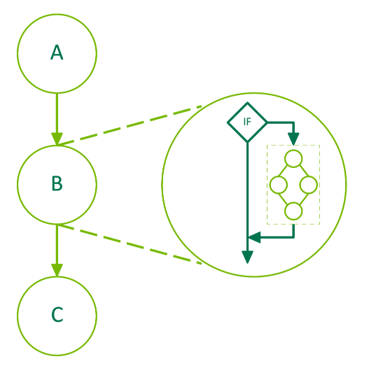

> 以下代码演示了如何创建包含 IF 条件节点的图形。条件的默认值是使用上游内核设置的。条件的正文是使用 graph API 填充的。

``` 
__global__ void setHandle(cudaGraphConditionalHandle handle)
{
    ...
    cudaGraphSetConditional(handle, value);
    ...
}

void graphSetup() {
    cudaGraph_t graph;
    cudaGraphExec_t graphExec;
    cudaGraphNode_t node;
    void *kernelArgs[1];
    int value = 1;

    cudaGraphCreate(&graph, 0);

    cudaGraphConditionalHandle handle;
    cudaGraphConditionalHandleCreate(&handle, graph);

    // Use a kernel upstream of the conditional to set the handle value
    cudaGraphNodeParams params = { cudaGraphNodeTypeKernel };
    params.kernel.func = (void *)setHandle;
    params.kernel.gridDim.x = params.kernel.gridDim.y = params.kernel.gridDim.z = 1;
    params.kernel.blockDim.x = params.kernel.blockDim.y = params.kernel.blockDim.z = 1;
    params.kernel.kernelParams = kernelArgs;
    kernelArgs[0] = &handle;
    cudaGraphAddNode(&node, graph, NULL, 0, &params);

    cudaGraphNodeParams cParams = { cudaGraphNodeTypeConditional };
    cParams.conditional.handle = handle;
    cParams.conditional.type   = cudaGraphCondTypeIf;
    cParams.conditional.size   = 1;
    cudaGraphAddNode(&node, graph, &node, 1, &cParams);

    cudaGraph_t bodyGraph = cParams.conditional.phGraph_out[0];

    // Populate the body of the conditional node
    ...
    cudaGraphAddNode(&node, bodyGraph, NULL, 0, &params);

    cudaGraphInstantiate(&graphExec, graph, NULL, NULL, 0);
    cudaGraphLaunch(graphExec, 0);
    cudaDeviceSynchronize();

    cudaGraphExecDestroy(graphExec);
    cudaGraphDestroy(graph);
}
```


###### 3.2.8.7.8.4. Conditional WHILE Nodes
> WHILE 节点的主体图将一直执行，直到条件为非零。该条件将在执行节点时和主体图完成后进行评估。下图描述了一个 3 节点图，其中中间节点 B 是条件节点

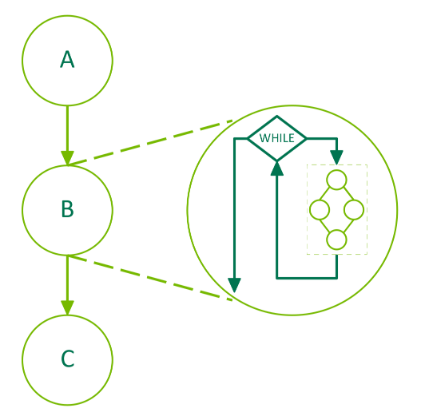

> 下面的代码演示了如何创建包含 WHILE 条件节点的图形。句柄是使用 cudaGraphCondAssignDefault 创建的，以避免对上游内核的需求。条件的正文是使用 graph API 填充的。

``` 
__global__ void loopKernel(cudaGraphConditionalHandle handle)
{
    static int count = 10;
    cudaGraphSetConditional(handle, --count ? 1 : 0);
}

void graphSetup() {
    cudaGraph_t graph;
    cudaGraphExec_t graphExec;
    cudaGraphNode_t node;
    void *kernelArgs[1];

    cuGraphCreate(&graph, 0);

    cudaGraphConditionalHandle handle;
    cudaGraphConditionalHandleCreate(&handle, graph, 1, cudaGraphCondAssignDefault);

    cudaGraphNodeParams cParams = { cudaGraphNodeTypeConditional };
    cParams.conditional.handle = handle;
    cParams.conditional.type   = cudaGraphCondTypeWhile;
    cParams.conditional.size   = 1;
    cudaGraphAddNode(&node, graph, NULL, 0, &cParams);

    cudaGraph_t bodyGraph = cParams.conditional.phGraph_out[0];

    cudaGraphNodeParams params = { cudaGraphNodeTypeKernel };
    params.kernel.func = (void *)loopKernel;
    params.kernel.gridDim.x = params.kernel.gridDim.y = params.kernel.gridDim.z = 1;
    params.kernel.blockDim.x = params.kernel.blockDim.y = params.kernel.blockDim.z = 1;
    params.kernel.kernelParams = kernelArgs;
    kernelArgs[0] = &handle;
    cudaGraphAddNode(&node, bodyGraph, NULL, 0, &params);

    cudaGraphInstantiate(&graphExec, graph, NULL, NULL, 0);
    cudaGraphLaunch(graphExec, 0);
    cudaDeviceSynchronize();

    cudaGraphExecDestroy(graphExec);
    cudaGraphDestroy(graph);
}
```

---


#### 3.2.8.8. Events
> The runtime 还提供了一种密切监视设备进度以及执行准确计时的方法，方法是让应用程序异步记录程序中任何点的事件，并在这些事件完成时进行查询。当事件之前的所有任务（或可选的给定流中的所有命令）都已完成时，事件已完成。stream zero 中的事件在完成所有流中的所有上述任务和命令后完成。

##### 3.2.8.8.1. Creation and Destruction
The following code sample creates two events:

``` 
cudaEvent_t start, stop;
cudaEventCreate(&start);
cudaEventCreate(&stop);
```
They are destroyed this way:
```
cudaEventDestroy(start);
cudaEventDestroy(stop);
```

##### 3.2.8.8.2. Elapsed Time

在 Creation and Destruction 中创建的事件可用于按以下方式对 Creation and Destruction 的代码示例进行计时：
``` 
cudaEventRecord(start, 0);
for (int i = 0; i < 2; ++i) {
    cudaMemcpyAsync(inputDev + i * size, inputHost + i * size,
                    size, cudaMemcpyHostToDevice, stream[i]);
    MyKernel<<<100, 512, 0, stream[i]>>>
               (outputDev + i * size, inputDev + i * size, size);
    cudaMemcpyAsync(outputHost + i * size, outputDev + i * size,
                    size, cudaMemcpyDeviceToHost, stream[i]);
}
cudaEventRecord(stop, 0);
cudaEventSynchronize(stop);
float elapsedTime;
cudaEventElapsedTime(&elapsedTime, start, stop);
```
---
#### 3.2.8.9. Synchronous Calls
调用同步函数时，在设备完成请求的任务之前，不会将控制权返回给主机线程。在主机线程执行任何其他 CUDA 调用之前，可以通过使用某些特定标志进行调用 cudaSetDeviceFlags() 来指定主机线程是否会产生、阻塞或旋转（有关详细信息，请参阅参考手册）。


