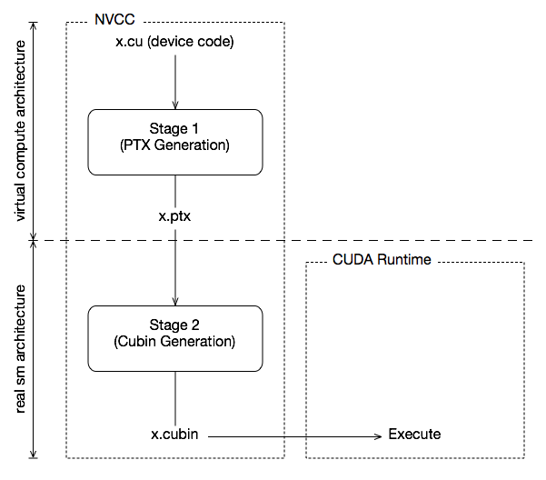
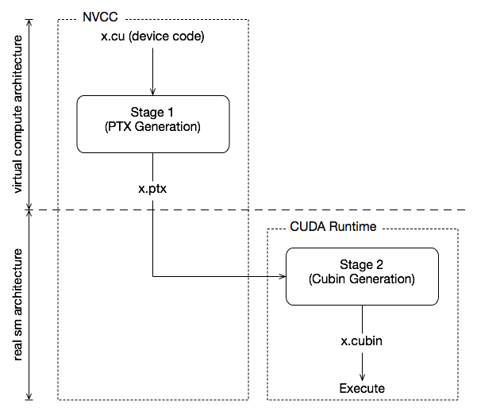

# Programming Interface

## 3.1. Compilation with NVCC

> PTX 参考手册中介绍的称为 PTX 的 CUDA 指令集架构编写内核。 但是，使用高级编程语言（如 C++）通常更有效。在这两种情况下，内核都必须编译成二进制代码 nvcc 才能在设备上执行  
> nvcc 是一个编译器驱动程序，可简化编译 C++ 或 PTX 代码的过程：它提供简单而熟悉的命令行选项，并通过调用实现不同编译阶段的工具集合来执行它们。

### 3.1.1. Compilation Workflow
#### 3.1.1.1. Offline Compilation
> 编译的源文件可以包括host code （即在主机上执行的代码）和device code（即在设备上执行的代码）的 nvcc 组合。
> 1. 将device code编译为汇编形式（PTX 代码）和/或二进制形式（cubin 对象），
> 2. 以及修改主机代码，方法是将内核中引入的 <<<...>>> 语法（并在执行配置中更详细地描述）替换为必要的 CUDA 运行时函数调用，以从 PTX 代码和/或 cubin 对象加载和启动每个编译的内核。
     
#### 3.1.1.2. Just-in-Time Compilation
> 应用程序在运行时加载的任何 PTX 代码都会由设备驱动程序进一步编译为二进制代码。这称为实时编译。

### 3.1.2. Binary Compatibility
> Binary code is architecture-specific. A cubin object is generated using the compiler option -code that specifies the targeted architecture: For example, compiling with -code=sm_80 produces binary code for devices of compute capability 8.0. 

### 3.1.3. PTX Compatibility
> 某些 PTX 指令仅在计算能力较高的设备上受支持。例如，Warp Shuffle Functions 仅在计算能力为 5.0 及更高版本的设备上受支持。 -arch 编译器选项指定将 C++ 编译为 PTX 代码时假定的计算能力。因此，例如，包含 warp shuffle 的代码必须使用 （或更高） 进行 -arch=compute_50 编译。  
> 为某些特定计算能力生成的 PTX 代码始终可以编译为具有更大或同等计算能力的二进制代码。请注意，从早期 PTX 版本编译的二进制文件可能无法使用某些硬件功能。例如，从为计算能力 6.0 （Pascal） 生成的 PTX 编译的计算能力 7.0 （Volta） 的二进制目标设备将不使用 Tensor Core 指令，因为这些指令在 Pascal 上不可用。因此，最终二进制文件的性能可能比使用最新版本的 PTX 生成二进制文件时的性能更差。

### 3.1.4. Application Compatibility
> 若要在具有特定计算能力的设备上执行代码，应用程序必须加载与此计算功能兼容的二进制代码或 PTX 代码，如二进制兼容性和 PTX 兼容性中所述。具体而言，为了能够在具有更高计算能力的未来体系结构上执行代码（尚无法生成二进制代码），应用程序必须加载 PTX 代码，这些代码将为这些设备进行实时编译（请参阅实时编译）。  
> CUDA C++ 应用程序中嵌入的 PTX 和二进制代码由 -arch 和 -code 编译器选项或 -gencode 编译器选项控制，详见 nvcc 用户手册。例如  
``` 
nvcc x.cu
        -gencode arch=compute_50,code=sm_50
        -gencode arch=compute_60,code=sm_60
        -gencode arch=compute_70,code=\"compute_70,sm_70\"
```
> x.cu 可以具有使用变形减少操作的优化代码路径，例如，仅在计算能力为 8.0 及更高版本的设备中受支持。该 __CUDA_ARCH__ 宏可用于根据计算能力区分各种代码路径。它仅针对设备代码定义。例如，当编译时 -arch=compute_80 ， __CUDA_ARCH__ 等于 800 .   
> Volta 架构引入了独立线程调度，它改变了线程在 GPU 上的调度方式。对于依赖于以前体系结构中 SIMT 调度的特定行为的代码，独立线程调度可能会更改参与线程集，从而导致不正确的结果。为了在实施独立线程调度中详述的纠正措施时帮助迁移，Volta 开发人员可以使用编译器选项组合 -arch=compute_60 -code=sm_70 选择加入 Pascal 的线程调度。  
> nvcc 用户手册列出了 -arch 、 -code 和 -gencode 编译器选项的各种简写。例如，是 -arch=compute_70 -code=compute_70,sm_70 的简写（ -arch=sm_70 与 -gencode arch=compute_70,code=\"compute_70,sm_70\" 相同）。

### 3.1.5. C++ Compatibility

### 3.1.6. 64-Bit Compatibility

---
## 3.2 CUDA Runtime
> The runtime is implemented in the cudart library, which is linked to the application, either statically via cudart.lib or libcudart.a, or dynamically via cudart.dll or libcudart.so

### 3.2.1. Initialization
> 从 CUDA 12.0 开始， cudaInitDevice() 和 cudaSetDevice() 调用初始化运行时以及与指定设备关联的主上下文。如果没有这些调用，运行时将隐式使用设备 0 并根据需要进行自初始化，以处理其他运行时 API 请求。在对运行时函数调用进行计时以及将第一次调用的错误代码解释到运行时时，需要牢记这一点。在 12.0 之前，不会初始化运行时， cudaSetDevice() 应用程序通常会使用无操作运行时调用 cudaFree(0) 来将运行时初始化与其他 API 活动隔离开来（出于计时和错误处理的考虑）。  
> 运行时为系统中的每个设备创建一个 CUDA 上下文（有关 CUDA 上下文的更多详细信息，请参阅上下文）。此上下文是此设备的主上下文，并在第一个运行时函数时初始化，该函数需要此设备上的活动上下文。它在应用程序的所有主机线程之间共享。作为此上下文创建的一部分，如有必要，将对设备代码进行实时编译（请参阅实时编译）并加载到设备内存中。这一切都是透明发生的。例如，如果需要驱动程序 API 互操作性，可以从驱动程序 API 访问设备的主要上下文，如运行时和驱动程序 API 之间的互操作性中所述。   
> 

> 注意：
> 1. 设备上下文：对于系统中的每个设备，运行时都会创建一个设备上下文。每个设备上下文都是独立的，这意味着它们之间不会共享任何状态。  
> 2. 主上下文：每个设备都有一个主上下文。主上下文在设备上首次调用需要设备上下文的函数时初始化。之后，该设备上的所有活动都将在主上下文中进行。  
> 3. 共享内存：CUDA 上下文中的共享内存允许不同的线程或任务在设备上共享数据。这使得并行计算更加高效，因为数据可以在不同的线程之间共享，而无需通过主机进行复制。  
> 4. 实时编译：当 CUDA 程序首次在设备上运行时，它会被编译成一种低级别的代码，称为内核。然后，当同一程序在后续运行时，CUDA 将使用先前编译的内核，而不是重新编译。这使得计算非常高效，因为编译步骤通常是耗时的。  

> 当主机线程调用 cudaDeviceReset() 时，这会破坏主机线程当前运行的设备（即设备选择中定义的当前设备）的主要上下文。将此设备作为当前设备的任何主机线程进行的下一个运行时函数调用将为该设备创建新的主上下文。


### 3.2.2. Device Memory
> 如异构编程中所述，CUDA 编程模型假设系统由主机和设备组成，每个设备都有自己独立的内存。内核在设备内存不足的情况下运行，因此运行时提供了分配、解除分配和复制设备内存以及在主机内存和设备内存之间传输数据的函数。   
> 线性存储器通常使用 和释放 使用，主机存储器和设备存储器之间的数据传输通常使用 cudaMalloc() cudaFree() cudaMemcpy() 。在 Kernels 的向量加法代码示例中，需要将向量从主机内存复制到设备内存中：
* cudaMalloc() cudaFree() cudaMemcpy()
``` 
// Device code
__global__ void VecAdd(float* A, float* B, float* C, int N)
{
    int i = blockDim.x * blockIdx.x + threadIdx.x;
    if (i < N)
        C[i] = A[i] + B[i];
}

// Host code
int main()
{
    int N = ...;
    size_t size = N * sizeof(float);

    // Allocate input vectors h_A and h_B in host memory
    float* h_A = (float*)malloc(size);
    float* h_B = (float*)malloc(size);
    float* h_C = (float*)malloc(size);

    // Initialize input vectors
    ...

    // Allocate vectors in device memory
    float* d_A;
    cudaMalloc(&d_A, size);
    float* d_B;
    cudaMalloc(&d_B, size);
    float* d_C;
    cudaMalloc(&d_C, size);

    // Copy vectors from host memory to device memory
    cudaMemcpy(d_A, h_A, size, cudaMemcpyHostToDevice);
    cudaMemcpy(d_B, h_B, size, cudaMemcpyHostToDevice);

    // Invoke kernel
    int threadsPerBlock = 256;
    int blocksPerGrid =
            (N + threadsPerBlock - 1) / threadsPerBlock;
    VecAdd<<<blocksPerGrid, threadsPerBlock>>>(d_A, d_B, d_C, N);

    // Copy result from device memory to host memory
    // h_C contains the result in host memory
    cudaMemcpy(h_C, d_C, size, cudaMemcpyDeviceToHost);

    // Free device memory
    cudaFree(d_A);
    cudaFree(d_B);
    cudaFree(d_C);

    // Free host memory
    ...
}
```
* cudaMallocPitch() 和 cudaMalloc3D() , cudaMemcpy2D() and cudaMemcpy3D()
> 线性存储器也可以通过 cudaMallocPitch() 和 cudaMalloc3D() 进行分配。建议将这些函数用于 2D 或 3D 阵列的分配，因为它可确保适当填充分配以满足设备内存访问中所述的对齐要求，从而确保在访问 2D 数组和设备内存的其他区域（使用 cudaMemcpy2D() and cudaMemcpy3D() 函数）之间访问行地址或执行复制时的最佳性能。返回的音高（或步幅）必须用于访问数组元素。以下代码示例分配浮 width 点值的 x height 2D 数组，并演示如何在设备代码中循环访问数组元素：
``` 
// Host code
int width = 64, height = 64;
float* devPtr;
size_t pitch;
cudaMallocPitch(&devPtr, &pitch,
                width * sizeof(float), height);
MyKernel<<<100, 512>>>(devPtr, pitch, width, height);

// Device code
__global__ void MyKernel(float* devPtr,
                         size_t pitch, int width, int height)
{
    for (int r = 0; r < height; ++r) {
        float* row = (float*)((char*)devPtr + r * pitch);
        for (int c = 0; c < width; ++c) {
            float element = row[c];
        }
    }
}
```
``` 
// Host code
int width = 64, height = 64, depth = 64;
cudaExtent extent = make_cudaExtent(width * sizeof(float),
                                    height, depth);
cudaPitchedPtr devPitchedPtr;
cudaMalloc3D(&devPitchedPtr, extent);
MyKernel<<<100, 512>>>(devPitchedPtr, width, height, depth);

// Device code
__global__ void MyKernel(cudaPitchedPtr devPitchedPtr,
                         int width, int height, int depth)
{
    char* devPtr = devPitchedPtr.ptr;
    size_t pitch = devPitchedPtr.pitch;
    size_t slicePitch = pitch * height;
    for (int z = 0; z < depth; ++z) {
        char* slice = devPtr + z * slicePitch;
        for (int y = 0; y < height; ++y) {
            float* row = (float*)(slice + y * pitch);
            for (int x = 0; x < width; ++x) {
                float element = row[x];
            }
        }
    }
}
```
> 注意：为避免分配过多内存，从而影响系统范围的性能，请根据问题大小向用户请求分配参数。如果分配失败，您可以回退到其他速度较慢的内存类型（ cudaMallocHost() 、 等 cudaHostRegister() ），或返回一个错误，告知用户需要多少内存，但被拒绝了。如果应用程序由于某种原因无法请求分配参数，我们建议使用 cudaMallocManaged() 支持它的平台。

> 以下代码示例演示了通过运行时 API 访问全局变量的各种方法：
``` 
__constant__ float constData[256];
float data[256];
cudaMemcpyToSymbol(constData, data, sizeof(data));
cudaMemcpyFromSymbol(data, constData, sizeof(data));

__device__ float devData;
float value = 3.14f;
cudaMemcpyToSymbol(devData, &value, sizeof(float));

__device__ float* devPointer;
float* ptr;
cudaMalloc(&ptr, 256 * sizeof(float));
cudaMemcpyToSymbol(devPointer, &ptr, sizeof(ptr));
```

### 3.2.3. Device Memory L2 Access Management
> 当 CUDA 内核重复访问全局内存中的数据区域时，可以认为此类数据访问是persisting。另一方面，如果数据只被访问一次，则此类数据访问可以被视为streaming。  
> 从 CUDA 11.0 开始，计算能力为 8.0 及更高版本的设备能够影响 L2 缓存中数据的持久性，从而可能提供对全局内存的更高带宽和更低延迟的访问。

#### 3.2.3.1. L2 cache Set-Aside for Persisting Accesses
> 可以留出一部分 L2 缓存，用于将数据访问持久化到全局内存。持久性访问优先使用 L2 缓存的这一预留部分，而对全局内存的正常或流式访问只有在持久性访问未使用时才能利用 L2 的这一部分。
``` 
cudaGetDeviceProperties(&prop, device_id);
size_t size = min(int(prop.l2CacheSize * 0.75), prop.persistingL2CacheMaxSize);
cudaDeviceSetLimit(cudaLimitPersistingL2CacheSize, size); /* set-aside 3/4 of L2 cache for persisting accesses or the max allowed*/
```
> 注意：
> 1. 在多实例 GPU （MIG） 模式下配置 GPU 时，将禁用 L2 缓存预留功能。
> 2. 使用多进程服务 （MPS） 时，不能通过 cudaDeviceSetLimit 更改 L2 缓存预留大小。相反，只能在 MPS 服务器启动时通过环境变量 CUDA_DEVICE_DEFAULT_PERSISTING_L2_CACHE_PERCENTAGE_LIMIT 指定预留大小。

#### 3.2.3.2. L2 Policy for Persisting Accesses
>  访问策略窗口指定全局内存的连续区域，并在 L2 缓存中指定该区域内访问的持久性属性。  
> 下面的代码示例显示了如何使用 CUDA 流设置 L2 持久化访问窗口。
* CUDA Stream Example
``` 
cudaStreamAttrValue stream_attribute;                                         // Stream level attributes data structure
stream_attribute.accessPolicyWindow.base_ptr  = reinterpret_cast<void*>(ptr); // Global Memory data pointer
stream_attribute.accessPolicyWindow.num_bytes = num_bytes;                    // Number of bytes for persistence access.
                                                                              // (Must be less than cudaDeviceProp::accessPolicyMaxWindowSize)
stream_attribute.accessPolicyWindow.hitRatio  = 0.6;                          // Hint for cache hit ratio
stream_attribute.accessPolicyWindow.hitProp   = cudaAccessPropertyPersisting; // Type of access property on cache hit
stream_attribute.accessPolicyWindow.missProp  = cudaAccessPropertyStreaming;  // Type of access property on cache miss.

//Set the attributes to a CUDA stream of type cudaStream_t
cudaStreamSetAttribute(stream, cudaStreamAttributeAccessPolicyWindow, &stream_attribute);
```

* CUDA GraphKernelNode Example
``` 
cudaKernelNodeAttrValue node_attribute;                                     // Kernel level attributes data structure
node_attribute.accessPolicyWindow.base_ptr  = reinterpret_cast<void*>(ptr); // Global Memory data pointer
node_attribute.accessPolicyWindow.num_bytes = num_bytes;                    // Number of bytes for persistence access.
                                                                            // (Must be less than cudaDeviceProp::accessPolicyMaxWindowSize)
node_attribute.accessPolicyWindow.hitRatio  = 0.6;                          // Hint for cache hit ratio
node_attribute.accessPolicyWindow.hitProp   = cudaAccessPropertyPersisting; // Type of access property on cache hit
node_attribute.accessPolicyWindow.missProp  = cudaAccessPropertyStreaming;  // Type of access property on cache miss.

//Set the attributes to a CUDA Graph Kernel node of type cudaGraphNode_t
cudaGraphKernelNodeSetAttribute(node, cudaKernelNodeAttributeAccessPolicyWindow, &node_attribute); 
```
> 该 hitRatio 参数可用于指定接收该 hitProp 属性的访问比例。在上面的两个示例中，全局内存区域 [ptr..ptr+num_bytes) 中 60% 的内存访问具有 persisting 属性，40% 的内存访问具有 streaming 属性。哪些特定的内存访问被归类为持久化 （ hitProp ） 是随机的，概率约为 hitRatio ;概率分布取决于硬件架构和内存范围。


#### 3.2.3.3. L2 Access Properties
> 为不同的全局内存数据访问定义了三种类型的访问属性：
> 1. cudaAccessPropertyStreaming ：使用 streaming 属性发生的内存访问不太可能保留在 L2 缓存中，因为这些访问会优先逐出。
> 2. cudaAccessPropertyPersisting ：使用 persisting 属性发生的内存访问更有可能保留在 L2 缓存中，因为这些访问优先保留在 L2 缓存的预留部分。
> 3. cudaAccessPropertyNormal ：此访问属性将以前应用的持久访问属性强制重置为正常状态。

#### 3.2.3.4. L2 Persistence Example
> 以下示例展示了如何为持久访问预留 L2 缓存，通过 CUDA Stream 在 CUDA 内核中使用预留的 L2 缓存，然后重置 L2 缓存。
``` 
cudaStream_t stream;
cudaStreamCreate(&stream);                                                                  // Create CUDA stream

cudaDeviceProp prop;                                                                        // CUDA device properties variable
cudaGetDeviceProperties( &prop, device_id);                                                 // Query GPU properties
size_t size = min( int(prop.l2CacheSize * 0.75) , prop.persistingL2CacheMaxSize );
cudaDeviceSetLimit( cudaLimitPersistingL2CacheSize, size);                                  // set-aside 3/4 of L2 cache for persisting accesses or the max allowed

size_t window_size = min(prop.accessPolicyMaxWindowSize, num_bytes);                        // Select minimum of user defined num_bytes and max window size.

cudaStreamAttrValue stream_attribute;                                                       // Stream level attributes data structure
stream_attribute.accessPolicyWindow.base_ptr  = reinterpret_cast<void*>(data1);               // Global Memory data pointer
stream_attribute.accessPolicyWindow.num_bytes = window_size;                                // Number of bytes for persistence access
stream_attribute.accessPolicyWindow.hitRatio  = 0.6;                                        // Hint for cache hit ratio
stream_attribute.accessPolicyWindow.hitProp   = cudaAccessPropertyPersisting;               // Persistence Property
stream_attribute.accessPolicyWindow.missProp  = cudaAccessPropertyStreaming;                // Type of access property on cache miss

cudaStreamSetAttribute(stream, cudaStreamAttributeAccessPolicyWindow, &stream_attribute);   // Set the attributes to a CUDA Stream

for(int i = 0; i < 10; i++) {
    cuda_kernelA<<<grid_size,block_size,0,stream>>>(data1);                                 // This data1 is used by a kernel multiple times
}                                                                                           // [data1 + num_bytes) benefits from L2 persistence
cuda_kernelB<<<grid_size,block_size,0,stream>>>(data1);                                     // A different kernel in the same stream can also benefit
                                                                                            // from the persistence of data1

stream_attribute.accessPolicyWindow.num_bytes = 0;                                          // Setting the window size to 0 disable it
cudaStreamSetAttribute(stream, cudaStreamAttributeAccessPolicyWindow, &stream_attribute);   // Overwrite the access policy attribute to a CUDA Stream
cudaCtxResetPersistingL2Cache();                                                            // Remove any persistent lines in L2

cuda_kernelC<<<grid_size,block_size,0,stream>>>(data2);                                     // data2 can now benefit from full L2 in normal mode
```


#### 3.2.3.5. Reset L2 Access to Normal
> 将 L2 缓存重置为正常状态对于流式处理或正常内存访问以正常优先级利用 L2 缓存非常重要。有三种方法可以将持久性访问重置为正常状态。
> 1. Reset a previous persisting memory region with the access property, cudaAccessPropertyNormal. 
> 2. Reset all persisting L2 cache lines to normal by calling cudaCtxResetPersistingL2Cache(). 
> 3. Eventually untouched lines are automatically reset to normal. Reliance on automatic reset is strongly discouraged because of the undetermined length of time required for automatic reset to occur.


#### 3.2.3.6. Manage Utilization of L2 set-aside cache
> 在不同 CUDA 流中并发执行的多个 CUDA 内核可能会为其流分配不同的访问策略窗口。但是，L2 预留缓存部分在所有这些并发 CUDA 内核之间共享。因此，此预留缓存部分的净利用率是所有并发内核单独使用的总和。当持久性访问量超过预留的 L2 缓存容量时，将内存访问指定为持久性的好处会减弱。  
> 若要管理预留的 L2 缓存部分的利用率，应用程序必须考虑以下事项：
> 1. Size of L2 set-aside cache. 
> 2. CUDA kernels that may concurrently execute. 
> 3. The access policy window for all the CUDA kernels that may concurrently execute. 
> 4. When and how L2 reset is required to allow normal or streaming accesses to utilize the previously set-aside L2 cache with equal priority.

#### 3.2.3.7. Query L2 cache Properties
> 与 L2 缓存相关的属性是 struct 的一部分 cudaDeviceProp ，可以使用 CUDA 运行时 API cudaGetDeviceProperties 进行查询
> 1. l2CacheSize: The amount of available L2 cache on the GPU.
> 2. persistingL2CacheMaxSize: The maximum amount of L2 cache that can be set-aside for persisting memory accesses.
> 3. accessPolicyMaxWindowSize: The maximum size of the access policy window.


