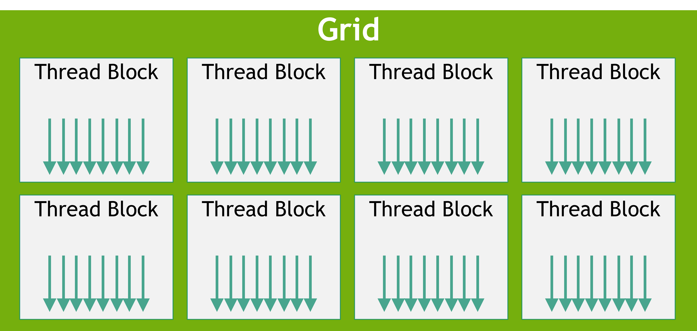
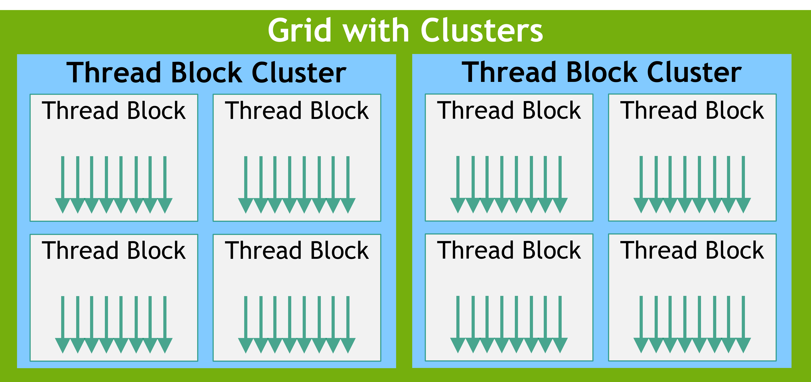
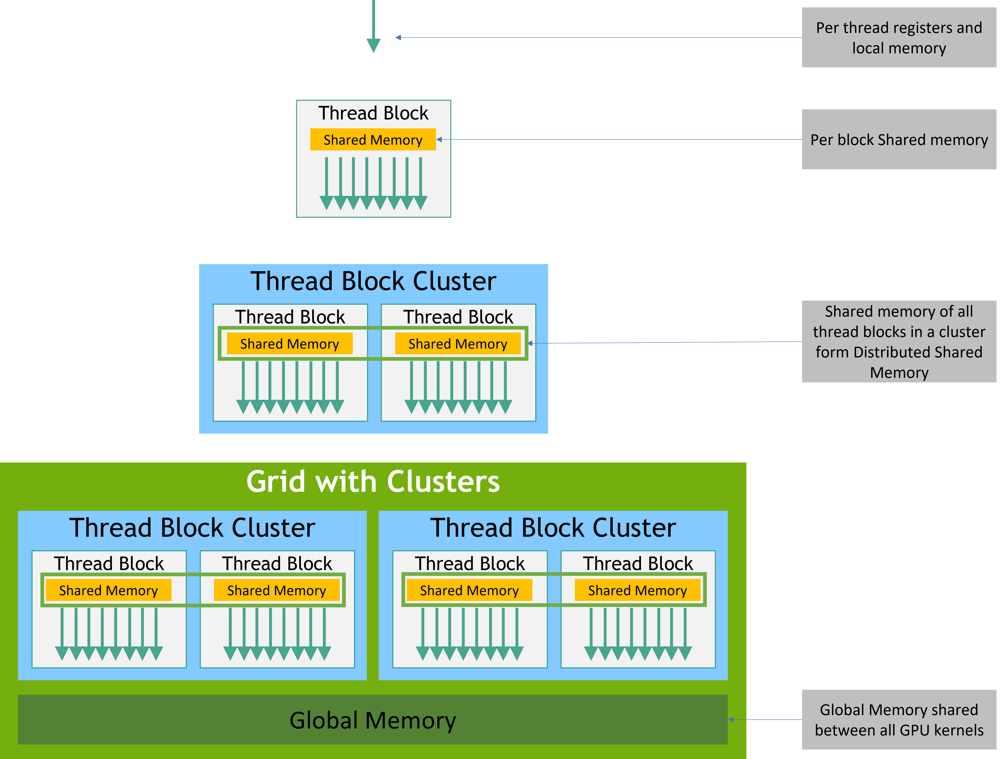
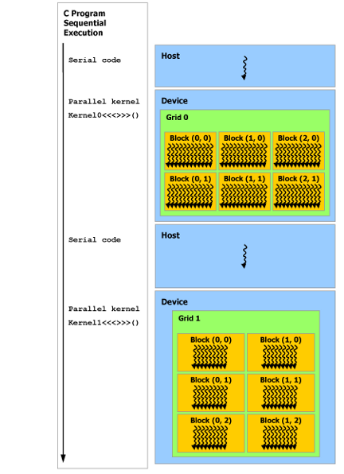

# Programming Model
## 2.1 Kernels
> 定义用   __global__  
> 使用用  <<<...>>>    
> 函数内部获取线程相对位置： threadIdx

``` 
// Kernel definition
__global__ void VecAdd(float* A, float* B, float* C)
{
    int i = threadIdx.x;
    C[i] = A[i] + B[i];
}

int main()
{
    ...
    // Kernel invocation with N threads
    VecAdd<<<1, N>>>(A, B, C);
    ...
}
```

## 2.2. Thread Hierarchy
> threadIdx is a 3-component vector (x, y, z)  
> block of size (Dx, Dy), the thread ID of a thread of index (x, y) is (x + y Dx);  
> block of size (Dx, Dy, Dz), the thread ID of a thread of index (x, y, z) is (x + y Dx + z Dx Dy).  
> 
``` 
// Kernel definition
__global__ void MatAdd(float A[N][N], float B[N][N],
                       float C[N][N])
{
    int i = threadIdx.x;
    int j = threadIdx.y;
    C[i][j] = A[i][j] + B[i][j];
}

int main()
{
    ...
    // Kernel invocation with one block of N * N * 1 threads
    int numBlocks = 1;
    dim3 threadsPerBlock(N, N);
    MatAdd<<<numBlocks, threadsPerBlock>>>(A, B, C);
    ...
}
```

> 网格中的每个块都可以由一维、二维或三维唯一索引来标识，该索引可通过内置 blockIdx 变量在内核中访问。线程块的维度可以通过内置变量 blockDim 在内核中访问。
``` 
// Kernel definition
__global__ void MatAdd(float A[N][N], float B[N][N],
float C[N][N])
{
    int i = blockIdx.x * blockDim.x + threadIdx.x;
    int j = blockIdx.y * blockDim.y + threadIdx.y;
    if (i < N && j < N)
        C[i][j] = A[i][j] + B[i][j];
}

int main()
{
    ...
    // Kernel invocation
    dim3 threadsPerBlock(16, 16);
    dim3 numBlocks(N / threadsPerBlock.x, N / threadsPerBlock.y);
    MatAdd<<<numBlocks, threadsPerBlock>>>(A, B, C);
    ...
}
```
> __syncthreads() 内部函数来指定内核中的同步点; __syncthreads() 充当障碍，块中的所有线程都必须等待，然后才能允许任何线程继续。
### 2.2.1 Thread Block Clusters
1. Thread Block Clusters that are made up of thread blocks.   
2. 集群中的线程块也保证在 GPU 中的 GPU 处理集群 （GPC） 上共同调度
3. a one-dimension, two-dimension, or three-dimension   
4. 每个集群最多8个线程块  
5. cudaOccupancyMaxPotentialClusterSize 
6. 属于集群的线程块可以访问分布式共享内存


### 调用方法
* 方法一： __cluster_dims__(X,Y,Z)
``` c++
// Kernel definition
// Compile time cluster size 2 in X-dimension and 1 in Y and Z dimension
__global__ void __cluster_dims__(2, 1, 1) cluster_kernel(float *input, float* output)
{

}

int main()
{
    float *input, *output;
    // Kernel invocation with compile time cluster size
    dim3 threadsPerBlock(16, 16);
    dim3 numBlocks(N / threadsPerBlock.x, N / threadsPerBlock.y);

    // The grid dimension is not affected by cluster launch, and is still enumerated
    // using number of blocks.
    // The grid dimension must be a multiple of cluster size.
    cluster_kernel<<<numBlocks, threadsPerBlock>>>(input, output);
} 
```
* 方法二：cudaLaunchKernelEx 
``` 
// Kernel definition
// No compile time attribute attached to the kernel
__global__ void cluster_kernel(float *input, float* output)
{

}

int main()
{
    float *input, *output;
    dim3 threadsPerBlock(16, 16);
    dim3 numBlocks(N / threadsPerBlock.x, N / threadsPerBlock.y);

    // Kernel invocation with runtime cluster size
    {
        cudaLaunchConfig_t config = {0};
        // The grid dimension is not affected by cluster launch, and is still enumerated
        // using number of blocks.
        // The grid dimension should be a multiple of cluster size.
        config.gridDim = numBlocks;
        config.blockDim = threadsPerBlock;

        cudaLaunchAttribute attribute[1];
        attribute[0].id = cudaLaunchAttributeClusterDimension;
        attribute[0].val.clusterDim.x = 2; // Cluster size in X-dimension
        attribute[0].val.clusterDim.y = 1;
        attribute[0].val.clusterDim.z = 1;
        config.attrs = attribute;
        config.numAttrs = 1;

        cudaLaunchKernelEx(&config, cluster_kernel, input, output);
    }
} 

```

### compute capability 9.0
``` 
cluster.sync()     //hardware-supported synchronization 
num_threads() 和 num_blocks() API 查询集群组大小的线程数或块数
dim_threads() 和 dim_blocks() The rank of a thread or block in the cluster group 
```


---

## 2.3 Memory Hierarchy
1.  Each thread has private local memory. 
2.  Each thread block has shared memory visible to all threads of the block and with the same lifetime as the block. 
3. Thread blocks in a thread block cluster can perform read, write, and atomics operations on each other’s shared memory. 
4. All threads have access to the same global memory.
5. 还有两个额外的只读内存空间可供所有线程访问:常量内存空间和纹理内存空间




---
## 2.4. Heterogeneous Programming

* 假设情况
1. CUDA 编程模型假定 CUDA 线程在物理上独立的设备上执行，该设备作为运行 C++ 程序的主机的协处理器运行。例如，当内核在 GPU 上执行，而 C++ 程序的其余部分在 CPU 上执行时，就是这种情况。 
2. 主机和设备在 DRAM 中维护自己独立的内存空间，分别称为主机内存和设备内存。因此，程序通过调用 CUDA 运行时（如编程接口中所述）来管理内核可见的全局、常量和纹理内存空间。这包括设备内存分配和释放，以及主机和设备内存之间的数据传输。

* 解决方案
> managed memory  
> 统一内存提供托管内存来桥接主机和设备内存空间。托管内存可从系统中的所有 CPU 和 GPU 作为具有公共地址空间的单个连贯内存映像进行访问。此功能支持设备内存的超额订阅，并且无需在主机和设备上显式镜像数据，

--- 

## 2.5.  Asynchronous SIMT Programming Model
> 1. An asynchronous operation is defined as an operation that is initiated by a CUDA thread and is executed asynchronously as-if by another thread.  
> 2. 异步线程(an as-if thread) 与 启动异步操作的 CUDA 线程相关联 . 异步操作使用同步对象来同步操作的完成。这样的同步对象可以由用户显式管理（cuda::memcpy_async） 和 库中隐式管理（cooperative_groups::memcpy_async）  
> 3. A synchronization object could be a cuda::barrier or a cuda::pipeline。 这些同步对象可以在不同的线程作用域中使用。作用域定义可以使用同步对象与异步操作同步的线程集。下表定义了 CUDA C++ 中可用的线程范围以及可以与每个线程同步的线程。
> 


--- 

##  Compute Capability
> 1. 设备的计算能力由版本号表示，有时也称为“SM 版本”。此版本号标识 GPU 硬件支持的功能，并由应用程序在运行时用于确定当前 GPU 上可用的硬件功能和/或指令。  
> 2. 计算功能包括一个主要修订号 X 和一个次要修订号 Y，用 X.Y 表示。  
> 3. 具有相同主要修订号的设备具有相同的内核体系结构。主要修订号为基于 NVIDIA Hopper GPU 架构的设备为 9，基于 NVIDIA Ampere GPU 架构的设备为 8，基于 Volta 架构的设备为 7，基于 Pascal 架构的设备为 6，基于 Maxwell 架构的设备为 5，基于 Kepler 架构的设备为 3。  


