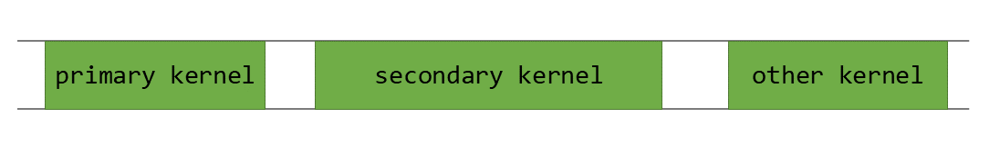
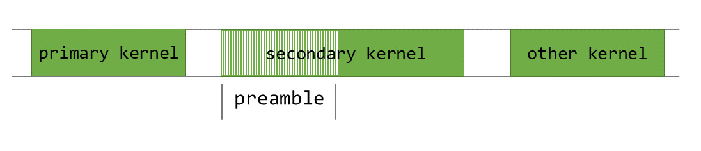
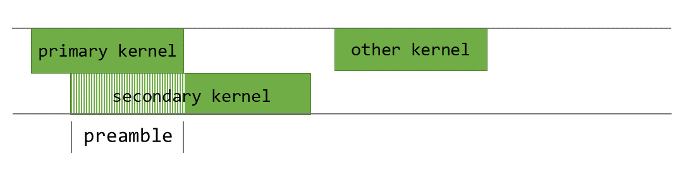
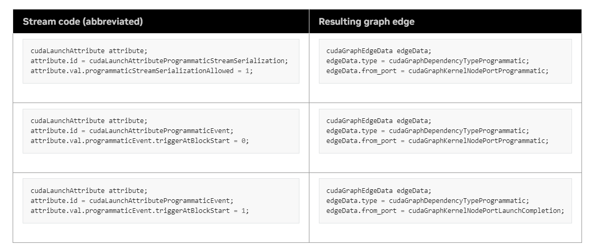
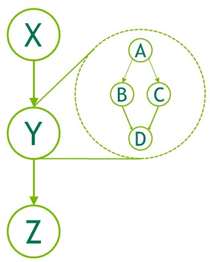
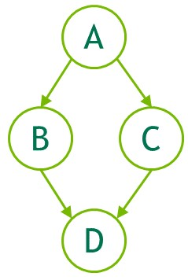

### 3.2.8. Asynchronous Concurrent Execution

> CUDA 将以下操作公开为可以并发操作的独立任务
> 1. Computation on the host; 
> 2. Computation on the device; 
> 3. Memory transfers from the host to the device; 
> 4. Memory transfers from the device to the host; 
> 5. Memory transfers within the memory of a given device; 
> 6. Memory transfers among devices.

#### 3.2.8.1. Concurrent Execution between Host and Device
> 以下设备操作相对于主机是异步的：
> 1. Kernel launches; 
> 2. Memory copies within a single device’s memory; 
> 3. Memory copies from host to device of a memory block of 64 KB or less; 
> 4. Memory copies performed by functions that are suffixed with Async; 
> 5. Memory set function calls.

> 程序员可以通过将 CUDA_LAUNCH_BLOCKING 环境变量设置为 1 来全局禁用系统上运行的所有 CUDA 应用程序的内核启动异步性。

#### 3.2.8.2. Concurrent Kernel Execution
> 某些计算能力为 2.x 及更高版本的设备可以同时执行多个内核。应用程序可以通过检查设备属性（请参阅 concurrentKernels 设备枚举）来查询此功能，对于支持此功能的设备，该属性等于 1。  
> 一个 CUDA 上下文中的内核不能与另一个 CUDA 上下文中的内核同时执行。GPU 可能会对时间片进行调整，以便为每个上下文提供前向进度。如果用户希望在 SM 上同时运行多个进程的内核，则必须启用 MPS。


#### 3.2.8.3. Overlap of Data Transfer and Kernel Execution
> 某些设备可以在执行内核的同时执行与 GPU 之间的异步内存复制。应用程序可以通过检查设备属性（请参阅 asyncEngineCount 设备枚举）来查询此功能，对于支持此功能的设备，该属性大于零。如果副本中涉及主机内存，则必须将其锁定。  
> 还可以在执行内核（在支持设备属性的设备上）和/或与设备之间的副本（对于支持该 asyncEngineCount 属性的设备）同时执行 concurrentKernels 设备内复制。设备内复制是使用标准内存复制功能启动的，目标地址和源地址位于同一设备上。

#### 3.2.8.4. Concurrent Data Transfers
> 某些计算能力为 2.x 及更高版本的设备可以重叠与设备之间的副本。应用程序可以通过检查设备属性（请参阅 asyncEngineCount 设备枚举）来查询此功能，对于支持此功能的设备，该属性等于 2。为了重叠，传输中涉及的任何主机内存都必须进行页面锁定。

#### 3.2.8.5. Streams
> 应用程序通过流管理上述并发操作。流是按顺序执行的一系列命令（可能由不同的主机线程发出）。另一方面，不同的流可能会彼此不按顺序执行命令，也可能同时执行命令;此行为无法保证，因此不应依赖其正确性（例如，内核间通信未定义）。当满足命令的所有依赖项时，可以执行对流发出的命令。依赖项可以是以前在同一流上启动的命令，也可以是来自其他流的依赖项。同步调用的成功完成保证了启动的所有命令都已完成。

##### 3.2.8.5.1. Creation and Destruction
``` 
cudaStream_t stream[2];
for (int i = 0; i < 2; ++i)
    cudaStreamCreate(&stream[i]);
float* hostPtr;
cudaMallocHost(&hostPtr, 2 * size);

//以下代码示例将每个流定义为从主机到设备的一个内存副本、一个内核启动和一个从设备到主机的内存副本的序列：
for (int i = 0; i < 2; ++i) {
    cudaMemcpyAsync(inputDevPtr + i * size, hostPtr + i * size,
                    size, cudaMemcpyHostToDevice, stream[i]);
    MyKernel <<<100, 512, 0, stream[i]>>>
          (outputDevPtr + i * size, inputDevPtr + i * size, size);
    cudaMemcpyAsync(hostPtr + i * size, outputDevPtr + i * size,
                    size, cudaMemcpyDeviceToHost, stream[i]);
}


for (int i = 0; i < 2; ++i)
    cudaStreamDestroy(stream[i]);

```

##### 3.2.8.5.2. Default Stream
> 对于使用编译标志 --default-stream per-thread 编译的代码（或在包含 CUDA 标头 （ cuda.h 和 cuda_runtime.h ） 之前定义 CUDA_API_PER_THREAD_DEFAULT_STREAM 宏的代码），默认流是常规流，每个主机线程都有自己的默认流。

> #define CUDA_API_PER_THREAD_DEFAULT_STREAM 1 不能用于在编译代码时启用此行为， nvcc 因为 nvcc 隐式包含在 cuda_runtime.h 翻译单元的顶部。在这种情况下，需要使用编译标志， --default-stream per-thread 或者需要使用 -DCUDA_API_PER_THREAD_DEFAULT_STREAM=1 编译器标志定义 CUDA_API_PER_THREAD_DEFAULT_STREAM 宏

>对于使用编译标志 --default-stream legacy 编译的代码，默认流是称为 NULL 流的特殊流，每个设备都有一个用于所有主机线程的 NULL 流。NULL 流很特殊，因为它会导致隐式同步，如隐式同步中所述。


##### 3.2.8.5.3. Explicit Synchronization
> 有多种方法可以显式地相互同步流。
> 1. cudaDeviceSynchronize() 等到所有主机线程的所有流中的所有前面的命令都完成。
> 2. cudaStreamSynchronize() 将流作为参数，并等待给定流中的所有前面命令都完成。它可用于将主机与特定流同步，从而允许其他流继续在设备上执行。
> 3. cudaStreamWaitEvent() 将流和事件作为参数（有关事件的描述，请参阅事件），并在调用后将所有命令添加到给定流中，以 cudaStreamWaitEvent() 延迟其执行，直到给定事件完成。
> 4. cudaStreamQuery() 为应用程序提供了一种了解流中所有上述命令是否已完成的方法。

##### 3.2.8.5.4. Implicit Synchronization
> 如果主机线程在两个命令之间发出以下任一操作，则无法同时运行来自不同流的两个命令：
> 1. a page-locked host memory allocation, 
> 2. a device memory allocation, 
> 3. a device memory set, 
> 4. a memory copy between two addresses to the same device memory, 
> 5. any CUDA command to the NULL stream, 
> 6. a switch between the L1/shared memory configurations described in Compute Capability 7.x.

##### 3.2.8.5.5. Overlapping Behavior
> 两个流之间的执行重叠量取决于向每个流发出命令的顺序，以及设备是否支持数据传输和内核执行的重叠（请参阅数据传输和内核执行的重叠）、并发内核执行（请参阅并发内核执行）和/或并发数据传输（请参阅并发数据传输）。
``` 
for (int i = 0; i < 2; ++i)
    cudaMemcpyAsync(inputDevPtr + i * size, hostPtr + i * size,
                    size, cudaMemcpyHostToDevice, stream[i]);
for (int i = 0; i < 2; ++i)
    MyKernel<<<100, 512, 0, stream[i]>>>
          (outputDevPtr + i * size, inputDevPtr + i * size, size);
for (int i = 0; i < 2; ++i)
    cudaMemcpyAsync(hostPtr + i * size, outputDevPtr + i * size,
                    size, cudaMemcpyDeviceToHost, stream[i]);
```

##### 3.2.8.5.6. Host Functions (Callbacks)
> 运行时提供了一种在任意点通过 cudaLaunchHostFunc() 将 CPU 函数调用插入到流中的方法。在回调完成之前，向流发出的所有命令完成后，都会在主机上执行提供的函数。
``` 
void CUDART_CB MyCallback(void *data){
    printf("Inside callback %d\n", (size_t)data);
}
...
for (size_t i = 0; i < 2; ++i) {
    cudaMemcpyAsync(devPtrIn[i], hostPtr[i], size, cudaMemcpyHostToDevice, stream[i]);
    MyKernel<<<100, 512, 0, stream[i]>>>(devPtrOut[i], devPtrIn[i], size);
    cudaMemcpyAsync(hostPtr[i], devPtrOut[i], size, cudaMemcpyDeviceToHost, stream[i]);
    cudaLaunchHostFunc(stream[i], MyCallback, (void*)i);
}
```

##### 3.2.8.5.7. Stream Priorities
> 流的相对优先级可以在创建时使用 cudaStreamCreateWithPriority() 指定。可以使用该 cudaDeviceGetStreamPriorityRange() 函数获得允许的优先级范围，排序为 [ 最高优先级， 最低优先级 ]。在运行时，高优先级流中的待处理工作优先于低优先级流中的待处理工作。
``` 
// get the range of stream priorities for this device
int priority_high, priority_low;
cudaDeviceGetStreamPriorityRange(&priority_low, &priority_high);
// create streams with highest and lowest available priorities
cudaStream_t st_high, st_low;
cudaStreamCreateWithPriority(&st_high, cudaStreamNonBlocking, priority_high);
cudaStreamCreateWithPriority(&st_low, cudaStreamNonBlocking, priority_low);
```
---
#### 3.2.8.6. Programmatic Dependent Launch and Synchronization

> 编程依赖启动机制允许依赖辅助内核在它所依赖的主内核完成执行之前启动。从计算能力 9.0 的设备开始可用，当辅助内核可以完成不依赖于主内核结果的重要工作时，此技术可以提供性能优势。  
##### 3.2.8.6.1. Background
> CUDA 应用程序通过在其上启动和执行多个内核来利用 GPU。


> 在这里， secondary_kernel 在完成其执行后 primary_kernel 启动。序列化执行通常是必需的，因为 secondary_kernel 依赖于 primary_kernel 生成的结果数据。如果 secondary_kernel 对 没有依赖 primary_kernel 性，则可以使用 CUDA 流同时启动它们。即使 secondary_kernel 依赖于 primary_kernel ，也存在并发执行的潜力。例如，几乎所有的内核都有某种前导码部分，在此期间执行诸如将缓冲区归零或加载常量值之类的任务。

> 演示了在不影响应用程序的情况下可以并发执行的部分 secondary_kernel 。请注意，并发启动还允许我们隐藏执行 primary_kernel 的启动延迟 secondary_kernel 。

>  secondary_kernel 并发启动和执行可以使用 Programmatic Dependent Launch 来实现。


##### 3.2.8.6.2. API Description
> 在 Programmatic Dependent Launch 中，主内核和辅助内核在同一个 CUDA 流中启动。当主内核准备好启动辅助内核时，它应该与所有线程块一起执行 cudaTriggerProgrammaticLaunchCompletion 。辅助内核必须使用可扩展的启动 API 启动，如下所示。
``` 
__global__ void primary_kernel() {
   // Initial work that should finish before starting secondary kernel

   // Trigger the secondary kernel
   cudaTriggerProgrammaticLaunchCompletion();

   // Work that can coincide with the secondary kernel
}

__global__ void secondary_kernel()
{
   // Independent work

   // Will block until all primary kernels the secondary kernel is dependent on have completed and flushed results to global memory
   cudaGridDependencySynchronize();

   // Dependent work
}

cudaLaunchAttribute attribute[1];
attribute[0].id = cudaLaunchAttributeProgrammaticStreamSerialization;
attribute[0].val.programmaticStreamSerializationAllowed = 1;
configSecondary.attrs = attribute;
configSecondary.numAttrs = 1;

primary_kernel<<<grid_dim, block_dim, 0, stream>>>();
cudaLaunchKernelEx(&configSecondary, secondary_kernel);
```
> 当使用该 cudaLaunchAttributeProgrammaticStreamSerialization 属性启动辅助内核时，CUDA 驱动程序可以安全地提前启动辅助内核，而不是等待主内核完成和内存刷新后再启动辅助内核。  
> 当所有主线程块都启动并执行 cudaTriggerProgrammaticLaunchCompletion 时，CUDA 驱动程序可以启动辅助内核。如果主内核不执行触发器，则在主内核中的所有线程块退出后隐式发生。  
> 无论哪种情况，辅助线程块都可能在主内核写入的数据可见之前启动。因此，当辅助内核配置了 Programmatic Dependent Launch 时，它必须始终使用 cudaGridDependencySynchronize 或其他方式来验证来自主内核的结果数据是否可用


##### 3.2.8.6.3. Use in CUDA Graphs


---
#### 3.2.8.7. CUDA Graphs
> CUDA Graphs 提供了一种在 CUDA 中提交工作的新模型。图形是一系列操作，例如内核启动，通过依赖项连接，依赖项与其执行分开定义。这允许图形定义一次，然后重复启动。将图形的定义与其执行分离可以实现许多优化：首先，与流相比，CPU 启动成本降低，因为大部分设置都是提前完成的;其次，将整个工作流呈现给 CUDA 可以实现优化，而流的分段工作提交机制可能无法实现。  
> 若要查看图形可能实现的优化，请考虑流中发生的情况：将内核放入流中时，主机驱动程序会执行一系列操作，为在 GPU 上执行内核做准备。这些操作是设置和启动内核所必需的，是必须为每个颁发的内核支付的开销成本。对于执行时间较短的 GPU 内核，此开销成本可能占整个端到端执行时间的很大一部分。   
> 使用图形提交工作分为三个不同的阶段：definition, instantiation, and execution.
> 1. 在定义阶段，程序会创建图中操作的描述以及它们之间的依赖关系。
> 2. 实例化获取图形模板的快照，对其进行验证，并执行大部分设置和初始化工作，目的是最大程度地减少启动时需要执行的操作。生成的实例称为可执行图。
> 3. 可执行图可以启动到流中，类似于任何其他 CUDA 工作。它可以在不重复实例化的情况下启动任意次数。


##### 3.2.8.7.1. Graph Structure
> 操作在图形中形成一个节点。操作之间的依赖关系是边缘。这些依赖关系限制了操作的执行顺序。  
> 一旦操作所依赖的节点完成，就可以随时调度操作。调度留给 CUDA 系统。

###### 3.2.8.7.1.1. Node Types
> A graph node can be one of:
> 1. kernel 
> 2. CPU function call 
> 3. memory copy 
> 4. memset 
> 5. empty node 
> 6. waiting on an event 
> 7. recording an event 
> 8. signalling an external semaphore 
> 9. waiting on an external semaphore 
> 10. conditional node 
> 11. child graph: To execute a separate nested graph, as shown in the following figure.



###### 3.2.8.7.1.2. Edge Data
> CUDA 12.3 在 CUDA Graphs 上引入了边缘数据。Edge 数据修改 Edge 指定的依赖关系，由三部分组成：an outgoing port, an incoming port, and a type。传出端口指定何时触发关联的 Edge。传入端口指定节点的哪一部分依赖于关联的 Edge。类型修改终结点之间的关系。  
> 边缘数据可以选择在各种图形 API 中通过并行数组指定到关联节点。如果省略它作为输入参数，则使用零初始化数据。如果将其省略为输出（查询）参数，则在被忽略的边缘数据全部初始化为零时，API 将接受此参数，并在调用将丢弃信息时返回 cudaErrorLossyQuery 此参数。

> 边缘数据在某些流捕获 API 中也可用： cudaStreamBeginCaptureToGraph() 、 cudaStreamGetCaptureInfo() 和 cudaStreamUpdateCaptureDependencies() 。在这些情况下，还没有下游节点。数据与悬空边（半边）相关联，该边将连接到将来捕获的节点，或在流捕获结束时丢弃。请注意，某些边缘类型不会等待上游节点完全完成。在考虑流捕获是否已完全重新加入源流时，将忽略这些边缘，并且不能在捕获结束时丢弃。请参阅使用流捕获创建图表。  
> 目前，没有节点类型定义额外的传入端口，只有内核节点定义额外的传出端口。有一种非默认依赖项类型， cudaGraphDependencyTypeProgrammatic 用于在两个内核节点之间启用编程依赖启动。

##### 3.2.8.7.2. Creating a Graph Using Graph APIs
> 可以通过两种机制创建图形：显式 API 和流捕获。以下是创建和执行下图的示例。

``` 
// Create the graph - it starts out empty
cudaGraphCreate(&graph, 0);

// For the purpose of this example, we'll create
// the nodes separately from the dependencies to
// demonstrate that it can be done in two stages.
// Note that dependencies can also be specified
// at node creation.
cudaGraphAddKernelNode(&a, graph, NULL, 0, &nodeParams);
cudaGraphAddKernelNode(&b, graph, NULL, 0, &nodeParams);
cudaGraphAddKernelNode(&c, graph, NULL, 0, &nodeParams);
cudaGraphAddKernelNode(&d, graph, NULL, 0, &nodeParams);

// Now set up dependencies on each node
cudaGraphAddDependencies(graph, &a, &b, 1);     // A->B
cudaGraphAddDependencies(graph, &a, &c, 1);     // A->C
cudaGraphAddDependencies(graph, &b, &d, 1);     // B->D
cudaGraphAddDependencies(graph, &c, &d, 1);     // C->D
```

##### 3.2.8.7.3. Creating a Graph Using Stream Capture
> 流捕获提供了一种从现有的基于流的 API 创建图形的机制。将工作启动到流中的代码部分（包括现有代码）可以用对 cudaStreamBeginCapture() 和 的 cudaStreamEndCapture() 调用括起来。见下文。
``` 
cudaGraph_t graph;

cudaStreamBeginCapture(stream);

kernel_A<<< ..., stream >>>(...);
kernel_B<<< ..., stream >>>(...);
libraryCall(stream);
kernel_C<<< ..., stream >>>(...);

cudaStreamEndCapture(stream, &graph);
```
> 调用将 cudaStreamBeginCapture() 流置于捕获模式。捕获流时，启动到流中的工作不会排队等待执行。相反，它被附加到一个正在逐步构建的内部图中。然后，通过调用 cudaStreamEndCapture() 返回此图形，这也结束了流的捕获模式。由流捕获主动构建的图形称为 capture graph。

###### 3.2.8.7.3.1. Cross-stream Dependencies and Events
> 流捕获可以处理用 cudaEventRecord() 和 cudaStreamWaitEvent() 表示的跨流依赖关系，前提是正在等待的事件已记录到同一捕获图中。  
> 在处于捕获模式的流中记录事件时，将导致捕获的事件。捕获的事件表示捕获图中的一组节点。
> 当流等待捕获的事件时，它会将流置于捕获模式（如果尚未进入捕获模式），并且流中的下一项将对捕获事件中的节点具有其他依赖关系。然后，将两个流捕获到同一个捕获图中。

``` 
// stream1 is the origin stream
cudaStreamBeginCapture(stream1);

kernel_A<<< ..., stream1 >>>(...);

// Fork into stream2
cudaEventRecord(event1, stream1);
cudaStreamWaitEvent(stream2, event1);

kernel_B<<< ..., stream1 >>>(...);
kernel_C<<< ..., stream2 >>>(...);

// Join stream2 back to origin stream (stream1)
cudaEventRecord(event2, stream2);
cudaStreamWaitEvent(stream1, event2);

kernel_D<<< ..., stream1 >>>(...);

// End capture in the origin stream
cudaStreamEndCapture(stream1, &graph);

// stream1 and stream2 no longer in capture mode
```


###### 3.2.8.7.3.2. Prohibited and Unhandled Operations
> 同步或查询正在捕获的流或捕获事件的执行状态是无效的，因为它们不表示计划执行的项目。查询或同步包含活动流捕获的更广泛句柄（例如，当任何关联的流处于捕获模式时，设备或上下文句柄）的执行状态也是无效的。  
> 如果捕获同一上下文中的任何流，并且它不是使用 创建的，则对旧流的任何尝试使用 cudaStreamNonBlocking 都是无效的。这是因为旧流句柄始终包含这些其他流;排队到旧流将创建对要捕获的流的依赖关系，查询或同步它将查询或同步要捕获的流。


###### 3.2.8.7.3.3. Invalidation
> 在流捕获期间尝试无效操作时，任何关联的捕获图都将失效。当捕获图失效时，进一步使用正在捕获的任何流或与该图关联的捕获事件都是无效的，并且将返回错误，直到流捕获以 结束 cudaStreamEndCapture() 。此调用将使关联的流退出捕获模式，但也会返回错误值和 NULL 图。


