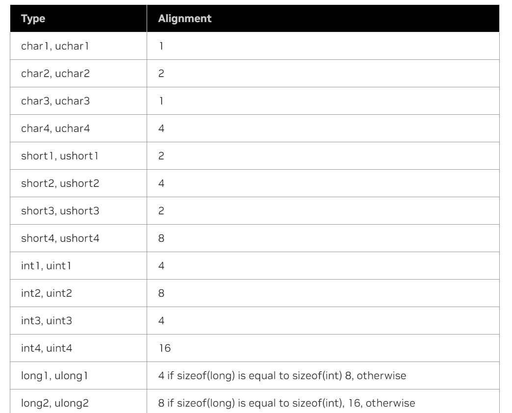
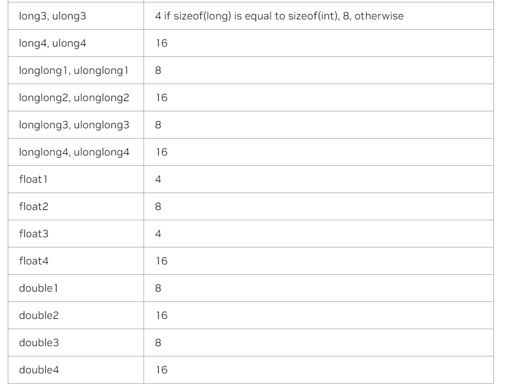

# 7. C++ Language Extensions


## 7.1. Function Execution Space Specifiers

### 7.1.1. \_\_global__

> \_\_global__ 执行空间说明符将函数声明为内核。这样的函数是
> 1. Executed on the device
> 2. Callable from the host
> 3. Callable from the device for devices of compute capability 5.0 or higher 

> \_\_global__ 函数必须具有 void 返回类型，并且不能是类的成员。  
> 对 \_\_global__ 函数的任何调用都必须指定其执行配置，如执行配置中所述。
> 对 \_\_global__ 函数的调用是异步的，这意味着它在设备完成执行之前返回。  


### 7.1.2. \_\_device__

> \_\_device__ 执行空间说明符声明一个函数，该函数为:
> 1. Executed on the device
> 2. Callable from the device only.

> \_\_global__ 和 \_\_device__ 执行空间说明符不能一起使用。

### 7.1.3. \_\_host__

> \_\_host__ 执行空间说明符声明一个函数，该函数为：
> 1. Executed on the host
> 2. Callable from the host only

> 它等效于声明一个仅带有执行空间说明符的函数，或者声明一个没有任何 \_\_host__ 、 \_\_device__ 或 \_\_global__ 执行空间说明符的 \_\_host__ 函数;无论哪种情况，该函数都仅针对主机进行编译。  
> \_\_global__ 和 \_\_host__ 执行空间说明符不能一起使用。  
> \_\_device__ and \_\_host__ 可以一起使用， 同时被host 和device编译。应用程序兼容性中引入的 \_\_CUDA_ARCH__ 宏可用于区分主机和设备之间的代码路径：

``` 
__host__ __device__ func()
{
#if __CUDA_ARCH__ >= 800
   // Device code path for compute capability 8.x
#elif __CUDA_ARCH__ >= 700
   // Device code path for compute capability 7.x
#elif __CUDA_ARCH__ >= 600
   // Device code path for compute capability 6.x
#elif __CUDA_ARCH__ >= 500
   // Device code path for compute capability 5.x
#elif !defined(__CUDA_ARCH__)
   // Host code path
#endif
}
```

### 7.1.4. Undefined behavior
> 在以下情况下，“cross-execution space”调用具有未定义的行为：
> 1. \_\_CUDA_ARCH__ 定义，从函数内部调用 \_\_global__ ， \_\_device__ 或 \_\_host__ \_\_device__ 函数对 \_\_host__ 函数的调用。
> 2. \_\_CUDA_ARCH__ 是 undefined，即从函数内部到 \_\_host__ \_\_device__ 函数的调用。

``` 
#include <stdio.h>

__global__ void Mykernel()
{
    printf("%d\n", __CUDA_ARCH__);
}

int main()
{
    Mykernel<<<1, 5>>>();
    cudaDeviceSynchronize();
    return 0;
}
```

### 7.1.5. \_\_noinline__ and \_\_forceinline__
> 编译器在认为适当时内联任何 \_\_device__ 函数    
> 函数限定符可以用作编译器不内联 \_\_noinline__ 函数（如果可能）的提示。      
> \_\_forceinline__ 函数限定符可用于强制编译器内联函数。    
> \_\_noinline__ 和 \_\_forceinline__ 函数限定符不能一起使用，并且两个函数限定符都不能应用于内联函数。  

### 7.1.6. \_\_inline_hint__

> 限 \_\_inline_hint__ 定符在编译器中启用更积极的内联。与 不同 \_\_forceinline__ ，它并不意味着该函数是内联的。在使用 LTO 时，它可用于改进跨模块的内联。
> \_\_noinline__ 或 \_\_forceinline__  不能和 \_\_inline_hint__ 一起使用

---

## 7.2. 可变内存空间说明符
> 变量内存空间说明符表示变量在设备上的内存位置     
> 在设备代码中声明的自动变量，没有任何本节中描述的 \_\_device__ 和 \_\_shared__ \_\_constant__ 内存空间说明符，通常驻留在寄存器中。但是，在某些情况下，编译器可能会选择将其放置在本地内存中，这可能会产生不利的性能后果，如设备内存访问中所述。

### 7.2.1. \_\_device__

> \_\_device__ 内存空间说明符声明驻留在设备上的变量  
> 最多可以与 \_\_device__ 以下三节中定义的其他内存空间说明符之一一起使用，以进一步表示变量所属的内存空间。如果它们都不存在，则变量：  
> 1. 驻留在全局内存空间中
> 2. 具有创建它的 CUDA 上下文的生命周期
> 3. 每个设备都有一个不同的对象
> 4. 可从网格内的所有线程访问，也可以通过运行时库 (cudaGetSymbolAddress() / cudaGetSymbolSize() / cudaMemcpyToSymbol() / cudaMemcpyFromSymbol() 


### 7.2.2. \_\_constant__
> \_\_constant__ 内存空间说明符（可选）与 \_\_device__ 一起使用，声明一个变量，该变量：
> 1. 驻留在恒定的内存空间中
> 2. 具有创建它的 CUDA 上下文的生命周期
> 3. 每个设备都有一个不同的对象
> 4. 可从网格内的所有线程访问，也可以通过运行时库 cudaGetSymbolAddress() / cudaGetSymbolSize() / cudaMemcpyToSymbol() / cudaMemcpyFromSymbol()

### 7.2.3. \_\_shared__
> \_\_shared__ 内存空间说明符（可选）与 \_\_device__ 一起使用，声明一个变量，该变量：
> 1. 驻留在线程块的共享内存空间中
> 2. 具有块的生命周期
> 3. 每个块有一个不同的对象
> 4. 只能从块内的所有线程访问
> 5. 没有固定地址

> 将共享内存中的变量声明为外部数组时，例如：
``` 
extern __shared__ float shared[];
```
> 数组的大小在启动时确定（请参阅执行配置）。以这种方式声明的所有变量都从内存中的同一地址开始，因此数组中变量的布局必须通过偏移量显式管理。例如，如果一个人想要等价的：  
> https://docs.nvidia.com/cuda/cuda-c-programming-guide/index.html#execution-configuration
``` 
short array0[128];
float array1[64];
int   array2[256];
```
> 在动态分配的共享内存中，可以按以下方式声明和初始化数组：
``` 
extern __shared__ float array[];
__device__ void func()      // __device__ or __global__ function
{
    short* array0 = (short*)array;
    float* array1 = (float*)&array0[128];
    int*   array2 =   (int*)&array1[64];
}
```

> 请注意，指针需要与它们指向的类型对齐，因此下面的代码（例如）不起作用，因为 array1 未与 4 个字节对齐。
``` 
extern __shared__ float array[];
__device__ void func()      // __device__ or __global__ function
{
    short* array0 = (short*)array;
    float* array1 = (float*)&array0[127];
}
```

### 7.2.4. \_\_grid_constant__

> \_\_grid_constant__ 大于或等于 7.0 的计算体系结构的注释对 const 非引用类型的限定 \_\_global__ 函数参数进行注释，该参数：
> 1. Has the lifetime of the grid
> 2. 是grid专用的，即主机线程和来自其他grid（包括sub-grids）的线程无法访问该对象
> 3. 每个grid都有一个不同的对象，即grid中的所有线程都看到相同的地址
> 4. 是只读的，即修改对象 \_\_grid_constant__ 或其任何子对象是未定义的行为，包括 mutable 成员

> Requirements:
> 1. 带注释的 \_\_grid_constant__ 内核参数必须具有 const 限定的非引用类型
> 2. 所有函数声明必须与任何 \_\_grid_constant_ 参数匹配。
> 3. 函数模板专用化必须与任何 \_\_grid_constant__ 参数的 primary template 声明匹配。
> 4. 函数模板实例化指令必须与任何 \_\_grid_constant__ 参数的 primary template 声明匹配

> 如果采用 \_\_global__ 函数参数的地址，编译器通常会在线程本地内存中复制内核参数并使用副本的地址，以部分支持 C++ 语义，这允许每个线程修改自己的函数参数本地副本。对 \_\_global__ 函数参数进行注释可 \_\_grid_constant__ 确保编译器不会在线程本地内存中创建内核参数的副本，而是使用参数本身的通用地址。避免使用本地副本可能会提高性能。

``` 
__device__ void unknown_function(S const&);
__global__ void kernel(const __grid_constant__ S s) {
   s.x += threadIdx.x;  // Undefined Behavior: tried to modify read-only memory

   // Compiler will _not_ create a per-thread thread local copy of "s":
   unknown_function(s);
}
```


### 7.2.5. \_\_managed__

> \_\_managed__ 内存空间说明符（可选）与 \_\_device__ 一起使用，声明一个变量，该变量：
> 1. 可以从设备和主机代码中引用，例如，可以获取其地址，也可以直接从设备或主机函数读取或写入。
> 2. 具有应用程序的生存期。

> https://docs.nvidia.com/cuda/cuda-c-programming-guide/index.html#managed-specifier


### 7.2.6. \_\_restrict__
> nvcc 支持通过 \_\_restrict__ 关键字限制指针  
> 
> C99 中引入了受限制的指针，以缓解 C 类语言中存在的混叠问题，并抑制了从代码重新排序到常见子表达式消除的所有优化  
> 下面是一个存在别名问题的示例，其中使用受限指针可以帮助编译器减少指令数  
``` 
void foo(const float* a,
         const float* b,
         float* c)
{
    c[0] = a[0] * b[0];
    c[1] = a[0] * b[0];
    c[2] = a[0] * b[0] * a[1];
    c[3] = a[0] * a[1];
    c[4] = a[0] * b[0];
    c[5] = b[0];
    ...
}
```

> 在 C 类语言中，指针 a 、 b 和 c 可以被别名化，因此任何写入 c 都可以修改 a 或 b 的元素。这意味着，为了保证功能的正确性，编译器不能将 a[0] 和 b[0] 加载到寄存器中，将它们相乘，并将结果存储到 和 c[0] c[1] 中，因为如果结果与抽象执行模型完全相同，则 a[0] 结果将与抽象执行模型不同 c[0] 。因此，编译器无法利用通用子表达式。同样，编译器不能只是将 的 c[4] 计算重新排序为 c[0] 和 c[1] 的计算接近，因为前面的写入 c[3] 可能会更改 的 c[4] 计算的输入。  

通过创建 a 、 b 和 c restricted 指针，程序员向编译器断言指针实际上没有别名，在这种情况下，这意味着写入 c 永远不会覆盖 a 或 b 的元素。这将更改函数原型，如下所示：
``` 
void foo(const float* __restrict__ a,
         const float* __restrict__ b,
         float* __restrict__ c);
```
请注意，所有指针参数都需要受到限制，编译器优化器才能获得任何好处。添加 \_\_restrict__ 关键字后，编译器现在可以随意重新排序和消除常见的子表达式，同时保留与抽象执行模型相同的功能：

``` 
void foo(const float* __restrict__ a,
         const float* __restrict__ b,
         float* __restrict__ c)
{
    float t0 = a[0];
    float t1 = b[0];
    float t2 = t0 * t1;
    float t3 = a[1];
    c[0] = t2;
    c[1] = t2;
    c[4] = t2;
    c[2] = t2 * t3;
    c[3] = t0 * t3;
    c[5] = t1;
    ...
}
```
> 这里的效果是减少了内存访问次数和计算次数。这可以通过“缓存”负载和公共子表达式导致的寄存器压力增加来平衡。  
> 由于寄存器压力是许多 CUDA 代码中的一个关键问题，因此由于占用率降低，使用受限指针可能会对 CUDA 代码产生负面影响。


---
## 7.3. Built-in Vector Types

### 7.3.1. char, short, int, long, longlong, float, double
这些是从基本整数和浮点类型派生的向量类型。它们是结构，第 1、2、3 和 4 个分量分别可通过字段x,y,z,w访问。它们都带有 form make_<type name> 的构造函数;例如
``` 
int2 make_int2(int x, int y);
```
> 它创建一个 值 (x, y) 为 的类型 int2 向量。  
> The alignment requirements of the vector types are detailed in the following table.






### 7.3.2. dim3
此类型是基于 uint3 该类型用于指定维度的整数向量类型。当定义一个类型的 dim3 变量时，任何未指定的组件都会初始化为 1。


---

## 7.4. Built-in Variables
> 内置变量指定栅格和块尺寸以及块和螺纹索引。它们仅在设备上执行的函数中有效。

### 7.4.1. gridDim
> 此变量的类型 dim3 （请参见 dim3 https://docs.nvidia.com/cuda/cuda-c-programming-guide/index.html#dim3 ）包含网格的尺寸


### 7.4.2. blockIdx
> 此变量的类型 uint3 （参见 char、short、int、long、longlong、float、double），并包含网格中的块索引。

### 7.4.3. blockDim
> 此变量的类型 dim3 （请参见 dim3 https://docs.nvidia.com/cuda/cuda-c-programming-guide/index.html#dim3 ）包含块的尺寸。

### 7.4.4. threadIdx
> 此变量的类型 uint3 （请参阅 char、short、int、long、longlong、float、double ），并包含块中的线程索引。


### 7.4.5. warpSize
> 此变量的类型 int 包含线程中的翘曲大小（有关翘曲的定义，请参阅 SIMT https://docs.nvidia.com/cuda/cuda-c-programming-guide/index.html#simt-architecture 体系结构）。


