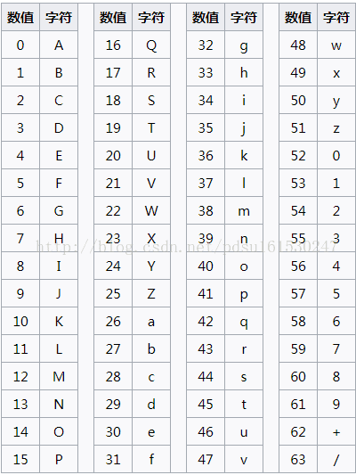
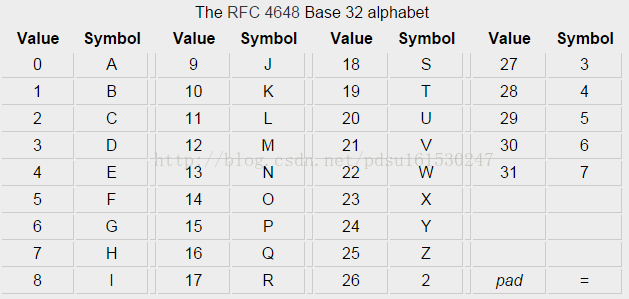
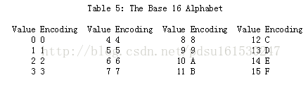

# Base编码
* Base64
* Base32
* Base16

---
1. Base64编码

* 描述
> ase6是网络上最常见的用于传输8Bit字节码的编码方式之一，base64就是一种基于64个可打印字符来表示二进制数据的表示方法。由于2的6次方等于64，所以每6个比特为一个单元，对应某个可打印字符。三个字节有24个比特，对应4个base64单元，即3个字节可表示4个可打印字符。它可用来作为电子邮件的传输编码。在base64中的可打印字符包括字母A-Z、a-z、数字0-9，这样共有62个字符，此外两个可打印符号在不同系统中而不同。

* 规则


* python 代码
```python
# 加密
>>> import base64
>>> encode = base64.b64encode(b'I love you')
>>> encode
b'SSBsb3ZlIHlvdQ=='

# 解密
>>> import base64
>>> decode = base64.b64decode(b'SSBsb3ZlIHlvdQ==')
>>> decode
b'I love you'
```
------
2. base32
* 描述 
> base32中只有大写字母（A-Z）和数字234567

* 规则


* python 代码
```python
# 加密
>>> import base64
>>> encode = base64.b32encode(b'I love you')
>>> encode
b'JEQGY33WMUQHS33V'

# 解密
>>> import base64
>>> decode = base64.b32decode(b'JEQGY33WMUQHS33V')
>>> decode
b'I love you'
```

---
3. base16
* 描述 
> base16中只有数字0-9以及大写字母ABCDEF

* 规则



* python 代码
```python
# 加密
>>> import base64
>>> encode = base64.b16encode(b'I love you')
>>> encode
b'JEQGY33WMUQHS33V'

# 解密
>>> import base64
>>> decode = base64.b16decode(b'JEQGY33WMUQHS33V')
>>> decode
b'I love you'
```
