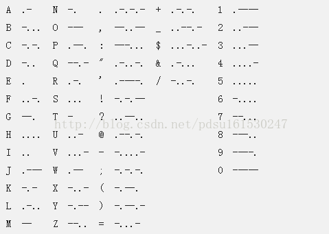

# 摩尔斯密码

* Morse code

---
## Morse code

* 描述
> 摩尔斯电码是一种早期的数字化通信形式，但是它不同于现代只使用0和1两种状态的二进制代码

* 规则



* python 代码

```python

MorseList = {
    ".-": "A", "-...": "B", "-.-.": "C", "-..": "D", ".": "E", "..-.": "F", "--.": "G",
    "....": "H", "..": "I", ".---": "J", "-.-": "K", ".-..": "L", "--": "M", "-.": "N",
    "---": "O", ".--．": "P", "--.-": "Q", ".-.": "R", "...": "S", "-": "T",
    "..-": "U", "...-": "V", ".--": "W", "-..-": "X", "-.--": "Y", "--..": "Z",

    "-----": "0", ".----": "1", "..---": "2", "...--": "3", "....-": "4",
    ".....": "5", "-....": "6", "--...": "7", "---..": "8", "----.": "9",

    ".-.-.-": ".", "---...": ":", "--..--": ",", "-.-.-.": ";", "..--..": "?",
    "-...-": "=", ".----.": "'", "-..-.": "/", "-.-.--": "!", "-....-": "-",
    "..--.-": "_", ".-..-.": '"', "-.--.": "(", "-.--.-": ")", "...-..-": "$",
    "....": "&", ".--.-.": "@", ".-.-.": "+",
}


def morse(string, sign):
    # 分割，字符串string，分割标识符sign
    lists = string.split(sign)
    for code in lists:
        print(MorseList.get(code), end="")

if __name__ == "__main__":
    morse("..-. .-.. .- --.", " ")

```

